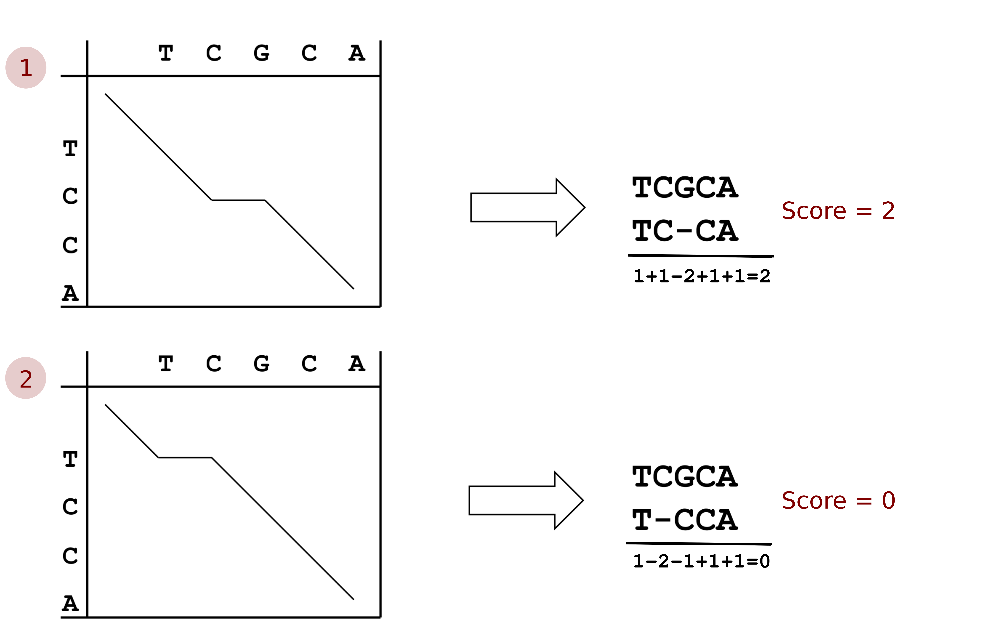
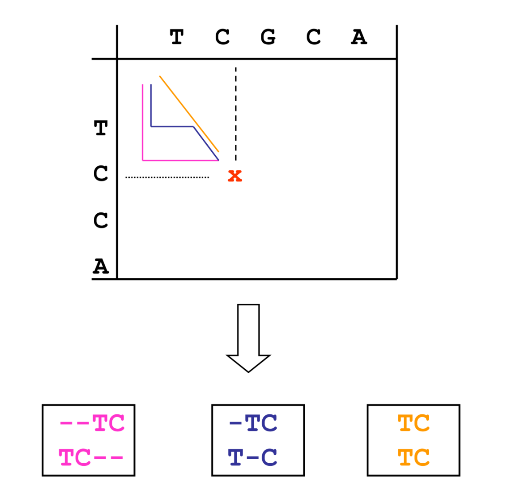
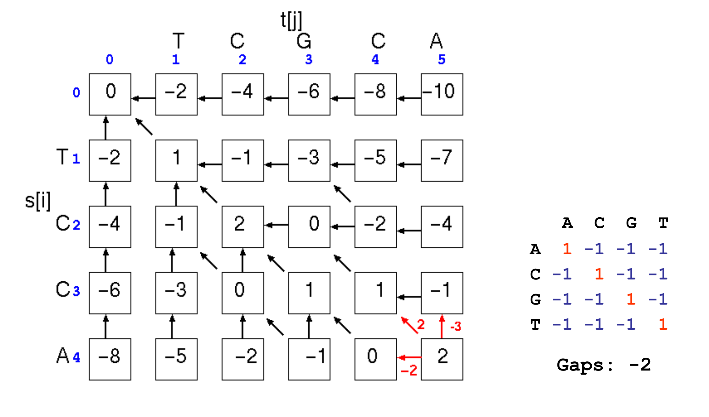
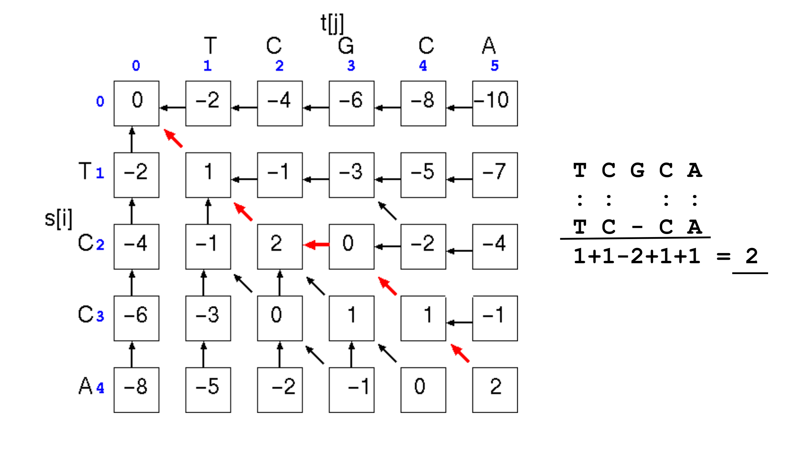

# **TP 3**. Alineamientos de secuencias de a pares

## Objetivos

* Entender el funcionamiento básico del algoritmo de alineamiento de pares de secuencias de Needleman-Wunsch.
* Aprender a interpretar un Dot-Plot, pudiendo identificar las regiones relevantes que contienen patrones.
* Comprender los conceptos de identidad, similitud y homología de secuencias, y establecer una clara diferencia entre los mismos. 

---

## Alineamientos de secuencias de a pares

El alineamiento de secuencias de a pares comprende la asignación uno-a-uno de correspondencias entre los elementos que componen dichas secuencias sin alterar su orden. En dicho proceso tres eventos principales pueden tener lugar:

* **Match (M)**: Cuando los elementos enfrentados son equivalentes.
* **Mismatch (m)**: Cuando los elementos correspondientes son diferentes.
* **Gap (g):** Cuando un elemento de una secuencia no tiene par en la otra y se enfrenta a un espacio, caracterizado por un guión (-).
    * **Gap open:** Cuando se abre un gap.
    * **Gap extend:** Cuando se agregan gaps a continuación de otro gap.

Por ejemplo, si alineamos las secuencias AFGIVHKLIVS y AFGIHKIVS un posible resultado sería:

<blockquote style="font-family:monospace">
A F G I V H K L I V S
<br>
A F G I - H K - I V S
</blockquote>

La principal función de los alineamientos es establecer una medida de **similitud** entre las secuencias que participan en el mismo. Para ello es necesario definir un **sistema de puntuación** que pese cada uno de los eventos que tienen lugar en la construcción del alineamiento. Asimismo, este esquema de puntajes o *scoring* nos permitirá optimizar el alineamiento de forma tal que los algoritmos empleados elijan la correspondencia entre secuencias que maximice el puntaje o *score* global.

Existen varios algoritmos de alineamiento:

* Los **alineamientos globales** (o de Needleman-Wunsch por sus creadores), se realizan apareando todos los elementos de una secuencia con todos los elementos de la otra. Este tipo de alineamientos se utiliza principalmente para comparar dos secuencias que son similares en longitud.

* Los **alineamientos locales** (o de Smith-Waterman), parean únicamente parte de las secuencias y son útiles para identificar, por ejemplo, dominios en común.

* Los **alineamientos mixtos**, que combinan los dos anteriores.

## **Dynamic programming**

Dado un par de secuencias y un sistema de puntuación o *scoring* se pueden aplicar diversos algoritmos para encontrar el alineamiento que dé el mejor puntaje.

El algoritmo más popular utiliza un método matemático llamado ***dynamic programming***. El mismo consiste en comparar ambas secuencias construyendo una matriz del alineamiento. Brevemente:

!!! info ""

    1. Se comienza en el extremo superior izquierdo de la matriz, con un puntaje inicial de 0. 
    2. En cada paso, se calcula el costo que tiene aparejado desplazarse de una celda a la otra, dado el sistema de puntajes pre-establecido, y se elige la opción más favorable, es decir aquella que **maximice** el puntaje global del alineamiento. 
    3. En cada iteración se guarda el puntaje con el que se llegó a una celda dada y el movimiento que originó dicho camino o *path*, indicado típicamente con una flecha. Una vez que la matriz está completa en su totalidad se puede recorrer hacia atrás o realizar un *traceback*, desde el extremo inferior derecho al superior izquierdo, para reconstruir el alineamiento.


La principal ventaja de este método es que **siempre encuentra el alineamiento óptimo** entre las secuencias dadas. 

Sin embargo, una desventaja es que pueden existir **varios** alineamientos que satisfagan esta condición. 

Otra desventaja es de origen técnica: la exhaustividad con la que el algoritmo realiza la búsqueda hace que su velocidad dependa de la longitud de las secuencias implicadas, haciendo poco eficiente la búsqueda de similitud de una secuencia contra una base de datos. Para esto existen diferentes adaptaciones del algoritmo que se verán más adelante.

### Ejemplo

Imaginen que queremos alinear las secuencias **TCGCA** y **TCCA** utilizando un esquema de *scoring* de:

* **Match:** M=1
* **Mismatch:** m=-1
* **Gap:** g=-2

Para eso ubicamos las secuencias en una matriz, donde cada una de sus dimensiones corresponda a una de las secuencias, tal como se muestra en la siguiente figura. 



Si observamos los *paths* **1** y **2** dibujados en las matrices de la figura podemos ver que se emplearon distintas estrategias para alinear este par de secuencias. 

* En **1** se eligió alinear los dos primeros nucleótidos **TC** por la diagonal, luego colocar un **gap** en la secuencia vertical **TCCA** y para finalizar se alinearon los nucleótidos **CA** restantes por la diagonal.      

* En **2** el primer nucleótido **T** de ambas secuencias se alineó por la diagonal, luego se colocó un **gap** en la secuencia vertical **TCCA** y finalmente se alinearon los 3 nucleótidos **GCA** y **CCA** restantes por la diagonal.      

Si computamos los puntajes de ambos alineamientos, obtenemos que:

* La **opción 1** tiene un puntaje de 2. Se propone colocar un único **gap** permitiendo alinear al resto de los nucleótidos en ambas secuencias con eventos de **match**.
* La **opción 2** tiene un puntaje de 0. Las secuencias estudiadas se alinean con 1 **gap**, 1 **mismatch** y 3 **matches**. La estrategia es subóptima en relación a **1**.

!!! question "Pregunta"

    Si hubiésemos aplicado la metodología de *dynamic programming* para realizar un alineamiento global de estas secuencias, ¿cuál sería el *path* óptimo resultante?

!!! done ""
    
    A *priori* uno pensaría que es el *path* **1**, pero hagamos el ejercicio para corroborar si esto es efectivamente así. 

Para comenzar, refresquemos cómo funcionaba el método de *dynamic programming*.



Para llegar desde el extremo superior izquierdo (= inicio) de la matriz del alineamiento a la posición marcada con una <span style="color:red;font-family:monospace"><b>x</b></span> podríamos, hipotéticamente, tomar cualquiera de los caminos dibujados en la figura de más arriba. Estos *paths* darían alinemientos diferentes de las secuencias **TC** con **TC**. 

!!! question "Pregunta"
     
     Pero... ¿cuál es el procedimiento iterativo empleado por el método de *dynamic programming* para obtener el alineamiento óptimo entre dos secuencias?

!!! done ""

      Para llegar a cualquier celda de la matriz, uno puede acceder por, como máximo, 3 direcciones. La idea es siempre moverse en la dirección que maximice el *score* o puntaje. 


Veamos que :

* un movimiento en la dirección <span style="color:blue;"><b>horizontal</b></span>, de la posición **(i, j-1)** a la posición **(i, j)**, supone introducir un **gap** en la secuencia del eje vertical i
* un movimiento en la dirección <span style="color:green;"><b>diagonal</b></span>, de la posición **(i-1, j-1)** a la posición **(i, j)**, supone un **match** o un **mismatch** entre los nucleótidos enfrentados
* un movimiento en la dirección <span style="color:purple;"><b>vertical</b></span>, de la posición **(i-1, j)** a la posición **(i, j)**, supone introducir un **gap** en la secuencia del eje horizontal j

Teniendo en cuenta la fórmula para obtener el *score* enunciada más arriba, podemos comenzar con nuestro ejercicio!

Recordemos que la matriz se llenará iterativamente, comenzando por la celda del extremo superior izquierdo, que tiene un puntaje de 0. 


Para moverse del (0, 0) al (0, 1), hay una sóla opción, moverse en forma **horizontal**. Esto significa alinear **T** con un **gap**, lo cual da un score de 0 + (-2) = -2. 

```
eje j: T
eje i: -
```
Lo mismo pasa al moverse del (0, 0) al (1, 0), hay una sóla opción, moverse en forma **vertical**. Esto significa alinear **T** con un **gap**, lo cual también da un score de 0 + (-2) = -2. 

```
eje j: -
eje i: T
```

Para moverse del (0, 0) al (1, 1) hay 3 maneras: 


**1.** Hacer un movimiento **vertical**, lo cual da un score de -2 + (-2) = -4

* **-2** es el puntaje de la celda inicial (0, 1)
* El movimiento vertical implica colocar un **gap**: -2

!!! note "Resultado:"

   ```
   eje j: T -
   eje i: - T
   ```

**2.** Hacer un movimiento **horizontal**, lo cual da un score de -2 + (-2) = -4. Similar al caso anterior:

* **-2** es el puntaje de la celda inicial (1, 0)
* El movimiento horizontal implica colocar un **gap**: -2
    
!!! note "Resultado:"

   ```
   eje j: - T
   eje i: T -
   ```

**3.** Hacer un movimiento **diagonal**, lo cual da un score de 0 + (+1). Implica alinear ambos nucléotidos!

* **0** es el puntaje de la celda inicial (0, 0)
* Hay **T** en las ambas secuencias. Es un **match**: +1

!!! note "Resultado:"

   ```
   eje j: T 
   eje i: T
   ```

Para decidir qué valor ubicamos en la celda simplemente optamos por el que nos dé el **mayor score**, en este caso 1, y se marca el movimiento que lo produjo: un movimiento diagonal.

De esta manera podemos seguir completando la matriz, 


Obsevando la última celda computada, podemos ver que hay nuevamente 3 maneras de llegar a la misma, 

* Hacer un movimiento **vertical**, de (1, 3) a (2, 3): Es decir, introducir un **gap** en la secuencia horizontal j. Si (1, 3) tiene un *score* de -3, el nuevo *score* es: -3 + gap penalty = -3 + (-2) = -5 (flecha en dirección vertical).

* Hacer un movimiento **horizontal**, de (2, 2) a (2, 3). Es decir, introducir un gap en la secuencia vertical i. Si (2, 2) tiene un *score* de 2, el nuevo *score* es: 2 + gap penalty = 2 + (-2) = 0 (flecha en dirección horizontal).

* Hacer un movimiento **diagonal**, de (1, 2) a (2, 3). Es decir, alinear los nucleótidos G y C. Si (1, 2) tiene un *score* de -1, el nuevo *score* es: -1 + mismatch = -1 + (-1) = -2 (flecha en dirección diagonal).

El máximo de los 3 scores calculados es: max(-5, 0, -2) = 0, que corresponde al puntaje del **movimiento horizontal**. Entonces colocamos 0 en la celda (2, 3) y una flecha horizontal que indique el movimiento de (2, 2) a (2, 3).

Al completar todas las celdas de la matriz, podemos saber cuál es el puntaje de la celda ubicada en extremo inferior derecho, que en este caso resultó ser +2. Este también es el puntaje final del alineamiento.



Para reconstruir el mismo, se parte de la celda ubicada en extremo inferior derecho y se siguen las flechas hasta llegar a la celda de inicio, en el extremo superior izquierdo. 



Las flechas en <span style="color:red;font-weight:bold;"> rojo </span> resaltan el *path* del alineamiento, 

<blockquote style="font-family:monospace"> 
eje j: T C G C A
<br>
eje i: T C - C A 
</blockquote>

que podemos corroborar que es idéntico al *path* **1** del ejemplo que se planteó inicialmente. 

### Ejercicio 1

#### ✏️ Paso 1
En grupo, realizá el alineamiento de las secuencias **ATTGG** con **AGATGG**, usando el esquema de puntajes: M=1, m=-1, g=-2. 


<!---
Para esto, abrí el siguiente [Google Jamboard](https://jamboard.google.com/d/1MGSgTaSSm7bAoHsfw1HCg7CHxuVOfKWVORQmL2vyymw/edit?usp=sharing), guardá una copia local del mismo en tu Google Drive y compartí el GJamboard a tus compañeros de equipo. 

!!! attention "Atención"
      
      Para guardar una copia local del GJamboard en tu GDrive, cliqueá en el ícono con 3 puntitos, en el extremo superior derecho (Más acciones). Luego seleccioná la opción "Hacer una copia". Elegí la carpeta adonde deseas guardarlo dentro de tu unidad y cliqueá aceptar. 

¡Ahora estás listo para empezar! Recordá rellenar la matriz con todos los puntajes y flechas faltantes. Cuando termines, reconstruí el *path* del alineamiento.
--->

#### ✏️ Paso 2
Cuando termines el ejercicio anterior podés corrobar la solución que hallaste ingresando en [UniFreiburg-FreiburgRNATools](http://rna.informatik.uni-freiburg.de/Teaching/index.jsp?toolName=Needleman-Wunsch).

Seguí las siguientes instrucciones para usar este recurso web:

**a.** Ingresá las dos secuencias que querés alinear en los recuadros de **Input** **Sequence a** y **Sequence b**. 
Recordá que la secuencia que figura en tu matriz en sentido horizontal debe ser ingresada como **Sequence b** y la que figura en sentido vertical debe ser ingresada como **Sequence a**.

**b.** Seleccioná optimización de Similarity. 

**c.** Completá los valores de tu esquema de *scoring*.

En el output podrás apreciar dos salidas:

* A la izquierda, los valores de la matriz de alineamiento. Si cliqueas sobre los valores de la matriz, vas a observar que el valor sobre el que te paraste se colorea en verde, mientras que las celdas que dieron origen a ese valor se colorean en rosa. 

* A la derecha, se observa el alineamiento final, donde un match se esquematiza en con \*, un mismatch con \| y un gap con \_.

#### ✏️ Preguntas guía:

#### ✏️ Pregunta 1
Reproducí el alineamiento que vimos como ejemplo al inicio (**TCGCA** con **TCCA**, esquema de puntajes: M=1, m=-1, g=-2) en la web de la [UniFreiburg-FreiburgRNATools](http://rna.informatik.uni-freiburg.de/Teaching/index.jsp?toolName=Needleman-Wunsch)

¿Cuántas soluciones óptimas hay para este alineamiento? ¿Sucede lo mismo para el alineamiento que realizaste en el ✏️ Paso 1? ¿Por qué?

#### ✏️ Pregunta 2
Observá con detenimiento el output del panel de la izquierda (la matriz) 

Seleccioná una celda. ¿Qué sucede cuando cliqueás en una celda y se colorea en <span style="color:green;font-weight:bold">verde</span> y la celda aledaña a la misma en <span style="color:pink;font-weight:bold">rosa</span>?
¿A qué corresponde este coloreado o resaltado de las celdas?
<br>

Observá nuevamente la matriz del alineamiento que obtuviste en **1.2**. Cliquéa en la celda con puntaje -2 en la posición (A3, T2). Observá que se colorea en <span style="color:green;font-weight:bold">verde</span> y **dos** celdas aledañas a la misma en <span style="color:pink;font-weight:bold">rosa</span>. 
<br>
¿Entendés qué significa esto? ¿Podés relacionarlo con los dos caminos óptimos posibles que existen para este alineamiento?
<br>

<!--
**1.3.3** Finalmente te propongo que realices el siguiente alineamiento: 

* Sequence a: **AGATGG** y Sequence b: **ATTGGG**. 
* Seleccioná optimización de Similarity. 
* Esquema de puntajes: **M:1, m:-1, g:-5**. 

Registrá con atención el resultado. Ahora cambiemos el esquema de *scoring*, dejando el mismo valor para match, pero intercambiando los puntajes de gap y mismatch. 
¿Cómo cambió el output? ¿Qué observás ahora en las secuencias halladas como solución óptima en comparación a lo que arrojaba el algoritmo con los parámetros anteriores?
-->

## Dot-Plots

Los dot-plots son representaciones gráficas que dan un pantallazo sobre la similitud entre dos secuencias. En ellos se pueden identificar patrones que aporten información sobre la relación entre ambas secuencias.
La forma de obtener uno es muy sencilla: se establece una matriz donde cada elemento de una de las secuencias se corresponde con una fila y los de la otra con una columna. Acto seguido se procede a colorear cada celda donde los caracteres correspondientes a fila y columna sean equivalentes.
Por ejemplo:


Nosotros podemos utilizar la herramienta de EMBOSS ```dotmatcher``` para generar nuestros propios plots. Para esto, vamos a usar el **Google colab** que se encuentra al lado de los materiales del TP.

!!! info "Recordatorio"

    Para ver qué parámetros toma de entrada la función, se puede ver la ayuda corriendo ```dotmatcher -h``` en bash.


### Ejercicio 2

Generá la carpeta de trabajo con la estructura que vimos en el [TP1](https://bioinformatica-iib.github.io/introduccion_bioinformatica/practicos/TP01a_Linux/#pregunta-3)

#### ✏️ Paso 1
Descargá los materiales de este TP ejecutando el siguiente comando: 

```Bash
wget https://bioinformatica-iib.github.io/introduccion_bioinformatica/practicos/TP02_Alineamientos/data/Data-TP2.zip
```

#### ✏️ Paso 2
Descomprimí los materiales usando el siguiente comando 

```Bash
unzip Data-TP2.zip
```

#### ✏️ Paso 3
Listá el contenido de la carpeta datos  

```Bash
ls
```

#### ✏️ Paso 4
Utilizá la secuencia *HS-ch11-fragment.fasta* que se encuentra en la carpeta *data* para compararla contra sí misma. Esta secuencia es un pequeño fragmento del cromosoma 1 de *Homo sapiens* y la vamos a utilizar únicamente para ver algunos de los patrones que podemos encontrar en un dotplot. 

Visualizá el archivo *HS-ch11-fragment.fasta* 

```Bash
head HS-ch1-fragment.fasta 
```

#### ✏️ Paso 5
Generá un dotplot utilizando la secuencia *HS-ch11-fragment.fasta* contra sí misma.

```Bash
dotmatcher -graph pdf HS-ch1-fragment.fasta HS-ch1-fragment.fasta
```

**¿Qué podés interpretar de este dotplot?**

La verdad es que el plot es bastante ruidoso, esto sucede muy a menudo en secuencias genómicas ya que la cantidad de caracteres que componen las secuencias es muy limitada (solo 4) y por ello hay muchas ocurrencias y por lo tanto muchos puntos.
Para limpiar el plot y quedarnos con los matches más significativos podemos jugar con dos parámetros:

* *windowsize*: Tamaño de ventana
* *threshold*: Umbral de ocurrencia

Esto quiere decir que ```dotmatcher``` sólo va a poner un punto cuando un fragmento del largo *windowsize* contenga un score mayor a *threshold*.
Por ejemplo:

```Bash
dotmatcher -graph pdf -windowsize 50 -threshold 20 HS-ch1-fragment.fasta HS-ch1-fragment.fasta
```

Si aumentás estos parámetros podés ir eliminando fragmentos que corresponden a secciones compartidas más cortas, sin embargo existe una relación de compromiso, utilizar tamaño de ventana y umbral muy grandes nos llevan a perder información por lo que hay que seleccionarlos con cuidado. Aqui hay algunos patrones con los que te podés encontrar en este tipo de plots:


**a)** Match perfecto.  
**b)** Repeticiones.  
**c)** Palíndromo.  
**d)** Repeticiones invertidas.  
**e)** Zonas de baja complejidad (microsatelites).  
**f)** Zonas altamente repetitivas (minisatelites).  
**g)** Secuencias con alta conservación.  
**h)** Inserción o deleción.  

#### ✏️ Paso 5
Cambiá los parámetros *windowsize* y *threshold* hasta obtener un plot que te parezca adecuado. **¿Qué podés interpretar del mismo?** Identificá patrones.

#### ✏️ Paso 6
- Ingresá a [Dotlet.vital-it.ch](https://dotlet.vital-it.ch/).
- Haz clic en **`Input`**.
- Pega tu secuencia `HS-ch11-fragment.fasta` (con o sin cabecera `>`).
- Ponle un nombre (ej. `HS-ch11`) y haz clic en **`Ok`**.
- En los menús desplegables (Horizontal y Vertical), selecciona la misma secuencia (`HS-ch11`) en ambos. Esto hará una **autocomparación** para buscar repeticiones internas.

#### ✏️ Paso 7
- Es el número de letras que se comparan a la vez.
- **Valores recomendados para ADN:**
  - **7-9:** Muy sensible, pero genera mucho ruido.
  - **10-12:** Punto de equilibrio ideal (empieza aquí).
  - **15-20:** Muy estricto, solo muestra repeticiones largas y perfectas.
- Haz clic en **`Compute`** para generar el gráfico.

#### ✏️ Paso 8
Al hacer `Compute`, aparecerá un gráfico de barras (histograma):

- **Pico enorme a la izquierda** → Ruido (coincidencias al azar).
- **Pico pequeño a la derecha** → Señal biológica real.
- **Acción:** Arrastra la **manija izquierda** (umbral inferior) justo hasta el **valle** que separa ambos picos.
- **Resultado:** El fondo de puntos sucios desaparece y solo quedan las diagonales nítidas.

#### ✏️ Paso 9
- **Diagonal principal:** Línea recta de esquina a esquina. Es la secuencia comparada consigo misma (siempre presente).
- **Diagonales paralelas (fuera de la principal):** Indican **repeticiones internas**. Cuanto más larga y clara es la línea, más conservada está la repetición.

#### ✏️ Paso 10
- Haz **clic izquierdo** sobre cualquier punto o diagonal del gráfico.
- En la ventana inferior se mostrará el alineamiento exacto de esa posición.
- Usa las **teclas de flecha (↑, ↓, ←, →)** para moverte a lo largo de la diagonal y examinar la repetición en detalle.

!!! info "Identidad, Similitud y Homología"

    Los términos identidad, similitud y homología se suelen utilizar como sinónimos por muchos investigadores, sin embargo no lo son.

    * La **identidad** es una es una característica cuantitativa de un par de secuencias, donde se cuenta cuántos elementos (residuos, nucleótidos, aminoácidos etc) son idénticos entre ambas secuencias después de alinearlas. 

    * La **similitud** es una característica cuantitativa de un par de secuencias, donde se establece en qué grado estas se parecen (por ejemplo aplicando los algoritmos antes vistos, utilizando un sistema de puntaje) después de alinearlas. 

    * La **homología**, por otro lado, es una característica cualitativa, dos secuencias SON o NO SON homólogas. Homología implica específicamente que el par de secuencias estudiadas *provienen de un mismo ancestro común*. Esta afirmación es completamente hipotética, ya que, salvo en contados casos, no se puede corroborar. Uno puede inferir que este es el caso dado la similitud observada en las secuencias actuales, sin tener acceso a las secuencias ancestrales.

!!! attention "Atención"

    Decir que un par de secuencias tiene N% de homología es TOTALMENTE incorrecto.

A partir de esta relación entre similitud y homología se pueden inferir relaciones entre diferentes especies, buscar posibles funciones de una secuencia desconocida, etc.

### Ejercicio 3

Determinar qué especies están más relacionadas utilizando la ribonucleasa pancreática de caballo (*Equus caballus*), ballena enana (*Balaenoptera acutorostrata*) y canguro rojo (*Macropus rufus*).
 
#### ✏️ Paso 1
Utilizá la herramienta de alineamiento global de EMBOSS ```needle``` (pueden leer el manual para ver que opciones admite ejecutnado el comando ```man needle```) para comparar las tres secuencias.   

```Bash
needle -gapopen 10 -gapextend 1 -asequence *secuencia_1* -bsequence *secuencia_2* -outfile *salida*
```
#### ✏️ Paso 2
Observá e interpretá las salidas obtenidas.

* ¿Qué secuencias son más similares? ¿Tiene sentido el resultado obtenido?

#### ✏️ Paso 3
Analizá árbol filogenético de la Fig. 1 del [paper](https://drive.google.com/file/d/1CHS7KCkgDQvzqQ2A_l4y4LKRaoo8Eraf/view?usp=sharing) de O'Leary *et al.*, 2013. 
Sabiendo que los caballos y las ballenas pertenecen al clado *Euungulata* y los canguros al clado *Marsupialia*, ubicá estos clado en el árbol.

* ¿Esta información coincide con los resultados que obtuviste en el Paso 2?


