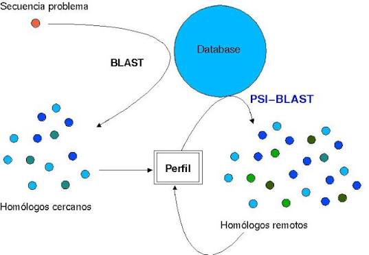
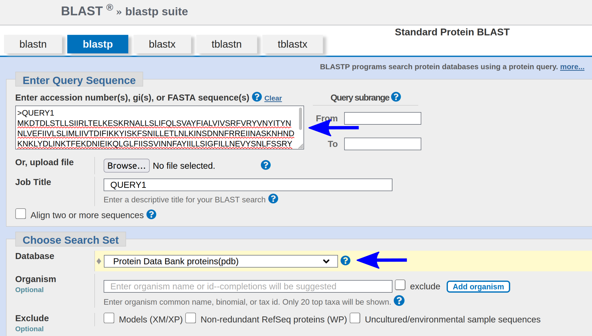
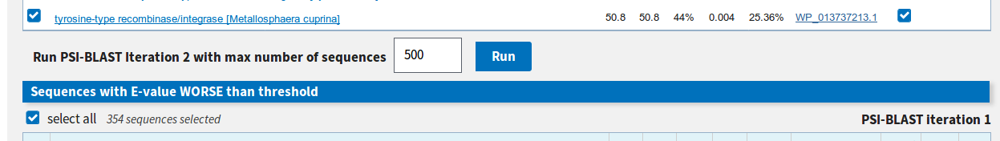
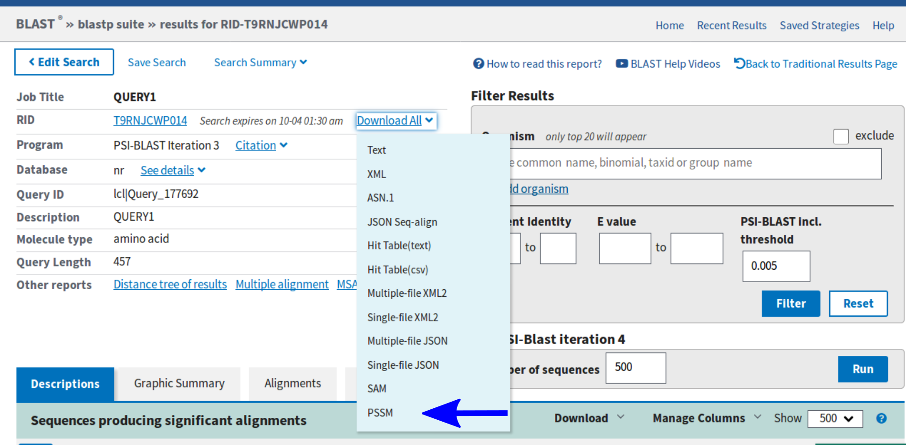

# **TP 5**. Uso de información contenida en alineamientos múltiples (Parte II): PSI‑BLAST, PSSMs, Profiles, HMMs, Sequence Logos

## Objetivos

1. Comprender el concepto de **PSSM** (Position‑Specific Scoring Matrix) y su utilidad para representar la conservación en un alineamiento múltiple.
2. Familiarizarse con **PSI‑BLAST** y su capacidad para detectar homólogos distantes mediante búsquedas iterativas.
3. Construir e interpretar **Sequence Logos** a partir de alineamientos de secuencias.
4. Conocer la arquitectura de un **perfil HMM** (estados match, inserción y deleción) y su ventaja sobre las PSSM para modelar familias con inserciones/deleciones.
5. Utilizar el paquete **HMMER** para construir un perfil HMM desde un alineamiento múltiple y realizar búsquedas en bases de datos.
6. Comparar los resultados obtenidos con PSI‑BLAST y HMMER, y reflexionar sobre sus aplicaciones.

---

## Introducción

<div style="border-left: 6px solid #555; background-color: #f5f5f5; padding: 12px 16px; margin: 16px 0; border-radius: 4px;">
De motivos lineales a dominios globulares

En el TP4 trabajamos con motivos lineales (SLiMs): secuencias cortas (3-15 aminoácidos), muy degeneradas, que suelen residir en regiones desordenadas de las proteínas y que pudimos representar mediante expresiones regulares. Sin embargo, la mayoría de las proteínas están organizadas en unidades estructurales y funcionales mucho más grandes llamadas dominios.

Un dominio proteico es una región de la proteína que puede plegarse de manera independiente y que posee una función específica (por ejemplo, unión a ATP, unión a ADN, actividad catalítica). Los dominios tienen características muy diferentes a los motivos lineales:

- Son más largos: típicamente de 50 a 250 aminoácidos.
- Están mucho más conservados evolutivamente.
- Presentan una arquitectura 3D globular estable.

Aceptan inserciones y deleciones (gaps) en sus regiones variables, que son fundamentales para la evolución de la familia.

Mientras que un motivo lineal se puede buscar con una expresión regular (una cadena de texto), un dominio requiere un modelo mucho más rico que asigne pesos específicos a cada posición (PSSM) y que modele probabilísticamente las inserciones y deleciones (HMM). Por eso, en este TP vamos a utilizar herramientas como PSI‑BLAST y HMMER para construir y buscar estos perfiles de dominios, y los representaremos visualmente mediante Sequence Logos.

</div>

---

## Ejercicio 1: Generación de una matriz PSSM

<div style="border-left: 6px solid #555; background-color: #f5f5f5; padding: 12px 16px; margin: 16px 0; border-radius: 4px;">

**PSSM (Position‑Specific Scoring Matrix)**

Una PSSM (también llamada perfil o matriz de pesos) es una tabla donde, para cada posición de un alineamiento, se almacena una puntuación (log‑odds) para cada uno de los 20 aminoácidos. Se construye a partir de las frecuencias observadas en el alineamiento, corregidas con pseudocuentas y comparadas con frecuencias de fondo. Una PSSM permite puntuar qué tan bien encaja una nueva secuencia en el perfil de la familia. Sin embargo, las PSSM no modelan de forma explícita los gaps (inserciones/deleciones) de longitud variable.

</div>


---

## Ejercicio 1: Generación e interpretación de un Sequence Logo

<div style="border-left: 6px solid #555; background-color: #f5f5f5; padding: 12px 16px; margin: 16px 0; border-radius: 4px;">

**Sequence Logos**

Un **Sequence Logo** es una representación gráfica de una PSSM. En cada posición, la altura total de la columna de letras es proporcional al contenido de información (conservación), y la altura de cada letra refleja su frecuencia en esa posición. Los colores suelen agrupar aminoácidos por propiedades químicas. Los logos permiten visualizar de un vistazo las posiciones conservadas y las variables.

</div>


<div style="border-left: 6px solid #555; background-color: #f5f5f5; padding: 12px 16px; margin: 16px 0; border-radius: 4px;">

Los logos son una herramienta muy útil para visualizar motivos de unión. En un logo de secuencia se grafica en el *eje y* el **contenido de información** de cada posición del motivo, generalmente expresado en *bits*. A su vez, la frecuencia con la que aparece una letra (nucleótido u amininoácido) en una dada posición se grafica con un tamaño proporcional a dicha magnitud.

Un servidor que nos permite generar fácilmente logos de secuencia es [Seq2Logo](https://services.healthtech.dtu.dk/service.php?Seq2Logo-2.0). Este método nos da la opción de ingresar un alineamiento múltiple (MSA), una lista de péptidos o una matriz peso-específica con la cual realizar el gráfico. 

La información puede pegarse directamente en el <span style="color:red;font-weight:bold;"> cuadro de texto </span> que provee la web, o subiendo directamente un archivo local utilizando la opción <span style="color:blue;font-weight:bold;"> Switch to file upload </span> que se encuentra debajo del cuadro.


Dentro de las opciones que nos permite cambiar tenemos:  

* **Logo type:** Esto refiere a la magnitud que se calculará para cada posición y se graficará en el eje y (Kullback-Leiber, Shannon, etc.).  
* **Clustering method:** Agrupa las secuencias que son muy similares para no sesgar el resultado, se pueden optar por diferentes métodos.  
* **Weight on prior:** Es el valor que le asignamos al parámetro *beta* en la ecuacion del cálculo del **contenido de información**. Recuerden que la relación entre *alfa* y *beta* es determinante para este cálculo.   
* **Information content units:** Generalmente se expresa en *bits*, pero en algunos casos se opta por *half-bits*.  
* **Output format:** El tipo de archivo de imagen adonde se guardará el logo. 

También tenemos la opción de realizar cambios avanzados, como modificar las frecuencias de *background* o la matriz de *scoring*, limitar la región del alineamiento que queremos graficar, etc. y opciones gráficas, como el tamaño de la imagen y los colores con los que se representa cada aminoácido.  

Por convención los colores que se utilizan son:  

* <span style="color:red;font-weight:bold;">Rojo</span>: Aminoácidos ácidos [DE]  
* <span style="color:blue;font-weight:bold;">Azul</span>: Aminoácidos básicos [HKR]  
* <span style="color:black;font-weight:bold;">Negro</span>: Aminoácidos hidrofóbicos [ACFILMPVW]  
* <span style="color:green;font-weight:bold;">Verde</span>: Aminoácidos polares y glicina [GNQSTY]  

</div>

### ✏️ Paso 1: Generar el logo con Seq2Logo

1. Ingresa a la página de Seq2Logo: [https://services.healthtech.dtu.dk/service.php?Seq2Logo-2.0](https://services.healthtech.dtu.dk/service.php?Seq2Logo-2.0)

2. En el campo de texto, pega las 5 secuencias

```Bash
    VFAAA
    VHYWW
    VLQPK
    LREWQ
    LPYIH
```

3. En las opciones de configuración:
   - **Logo type:** Selecciona *Shannon*.
   - **Clustering method:** Selecciona *None* (para que todas las secuencias pesen igual).
   - **Weight on prior (pseudo counts):** Pon **0**.
   - Deja las demás opciones por defecto.
4. Haz clic en **Generate Logo**.
5. Guarda el logo completo.

<div style="border-left: 6px solid #007bff; background-color: #f5f5f5; padding: 12px 16px; margin: 16px 0; border-radius: 4px;">
<strong>✏️ Pregunta 1:</strong><br>
Observa el logo resultante. ¿Cuáles son las posiciones con mayor contenido de información (mayor altura de la columna)? ¿Qué aminoácidos predominan en esas posiciones? 
</div>

<div style="border-left: 6px solid #007bff; background-color: #f5f5f5; padding: 12px 16px; margin: 16px 0; border-radius: 4px;">
<strong>✏️ Pregunta 2:</strong><br>
¿Qué posiciones tienen baja conservación (columnas con poca altura)? ¿Qué aminoácidos aparecen y por qué crees que son variables? 
</div>

<div style="border-left: 6px solid #555; background-color: #f5f5f5; padding: 12px 16px; margin: 16px 0; border-radius: 4px;">

<strong>¿Cómo se generan estos logos?</strong><br>

Para entender por qué los logos de los Experimentos A (prior=0) y B (prior=200) se ven tan diferentes, tenemos que mirar "debajo del capó" de Seq2Logo. La herramienta no hace magia: **traduce las secuencias en una PSSM (la misma que calcularán en el Ejercicio 2) y luego dibuja las letras en función de los números de esa matriz**.

Aquí te explico el proceso paso a paso y cómo el parámetro `Weight on prior` modifica radicalmente el resultado.

<strong>Conteo de frecuencias observadas</strong><br>

El programa comienza contando, para cada una de las 5 posiciones, cuántas veces aparece cada aminoácido en tus 5 secuencias.

Por ejemplo, en la **Posición 4** de tus secuencias:

    Sec1: V F A A A  → Pos4 = A
    Sec2: V H Y W W  → Pos4 = W
    Sec3: V L Q P K  → Pos4 = P
    Sec4: L R E W Q  → Pos4 = W
    Sec5: L P Y I H  → Pos4 = I

**Conteo observado (sin pseudocuentas):**
- W aparece 2 veces → frecuencia = 2/5 = 0.40
- A, P, I aparecen 1 vez cada uno → frecuencia = 0.20
- El resto de los 16 aminoácidos (incluyendo Y, F, H, etc.) → frecuencia = 0

</div>

### ✏️ Paso 2: Asignar Weight on prior

1. Repite exactamente los mismos pasos, pero esta vez cambia el valor de **Weight on prior** a **200**.

2. Genera el nuevo logo y toma otra captura de pantalla.

<div style="border-left: 6px solid #555; background-color: #f5f5f5; padding: 12px 16px; margin: 16px 0; border-radius: 4px;">

<strong>"Weight on prior" (β)</strong><br>

Aquí está la clave de todo. Seq2Logo no se queda solo con los conteos observados, sino que los **mezcla** con un "conocimiento previo" (prior) basado en la matriz de sustitución BLOSUM62. Esta matriz le dice al programa: *"Si ves una W (Triptófano), es muy probable que también puedas encontrar F o Y en su lugar, porque son aminoácidos similares"*.

La fórmula interna que usa el programa es esencialmente:

\[
\text{Frecuencia final} = \frac{\alpha \times (\text{Frecuencia observada}) + \beta \times (\text{Prior BLOSUM62})}{\alpha + \beta}
\]

- **\(\alpha\)** (alpha): Es el peso que le damos a los datos observados (fijo, suele ser 1).
- **\(\beta\)** (beta): **Es el "Weight on prior" que tú ajustaste (0, 200, etc.).**

Una vez que Seq2Logo tiene la tabla de frecuencias, hace dos cosas para dibujar:

1.  **Calcula el Score (Log-odds) para cada aminoácido:** \( S = \log_2 (\text{frecuencia final} / \text{frecuencia de fondo}) \). Esto da valores positivos (favorables) y negativos (desfavorables).
2.  **Calcula la altura total de la columna (bits):** Suma todas las contribuciones positivas. La fórmula es \( \text{Bits} = \sum (\text{frecuencia} \times S) \). Esto mide cuánta información hay en esa posición.
3.  **Dibuja las letras:** La altura de cada letra es proporcional a su contribución al total de bits. Las letras con scores negativos (penalizadas) no se dibujan.

</div>

---

## Ejercicio 2: Búsqueda de homólogos distantes con PSI‑BLAST

<div style="border-left: 6px solid #555; background-color: #f5f5f5; padding: 12px 16px; margin: 16px 0; border-radius: 4px;">

<strong>¿Qué es PSI‑BLAST?</strong><br>

**PSI‑BLAST** (siglas en inglés de *Position-Specific Iterated BLAST*) es una poderosa herramienta bioinformática diseñada para la búsqueda de homologías proteicas. Se trata de una evolución del conocido programa BLASTp que, en lugar de realizar una única comparación de la secuencia de consulta contra una base de datos, ejecuta un proceso de **búsqueda iterativa**.

Su principal objetivo es **detectar relaciones evolutivas distantes entre proteínas** que el BLAST estándar no puede encontrar. Muchas proteínas funcionalmente importantes han divergido tanto a nivel de secuencia que su similitud cae por debajo del "**umbral de penumbra**" (*twilight zone*, aproximadamente 25‑30% de identidad), donde la homología ya no puede inferirse de manera fiable mediante comparaciones directas de secuencias.



<strong>¿Cómo funciona?</strong><br>

El proceso de PSI‑BLAST se puede resumir en los siguientes pasos iterativos:

1. **Primera iteración (BLASTp estándar):**  
   La herramienta inicia tomando una **única secuencia proteica** (la consulta) y la compara con una base de datos de proteínas utilizando el programa BLAST con gaps. Esta primera ronda es idéntica a una búsqueda BLASTp normal.

2. **Construcción del perfil (PSSM):**  
   A partir de los alineamientos locales significativos encontrados en el paso anterior, el programa construye un **alineamiento múltiple**. De este alineamiento, calcula una **matriz de puntuación específica de posición** (**PSSM**, por sus siglas en inglés) o perfil.  
   Esta matriz no es una simple secuencia, sino un patrón que captura la **información de conservación** en cada posición del alineamiento:
   - A las posiciones altamente conservadas se les asignan puntuaciones altas.
   - A las posiciones poco conservadas se les asignan puntuaciones cercanas a cero.

3. **Búsqueda con el perfil:**  
   La PSSM recién creada se utiliza como la nueva "consulta" para realizar una nueva búsqueda en la base de datos. Esta búsqueda es mucho más sensible porque busca el patrón de conservación, no solo la secuencia original.

4. **Iteración y refinamiento:**  
   Las nuevas secuencias significativas encontradas en esta segunda ronda se añaden al alineamiento múltiple, y a partir de él se **refina la PSSM** para la siguiente ronda de búsqueda.

5. **Repetición hasta la convergencia:**  
   Este proceso de "construir perfil → buscar → refinar perfil" se repite de forma iterativa (de ahí su nombre) un número determinado de veces o hasta que **no se detecten nuevas secuencias significativas**, un estado conocido como **convergencia**.
</div>

### ✏️ Paso 1: Realizar una búsqueda BLAST

1. Ve a la página de BLAST del NCBI: [https://blast.ncbi.nlm.nih.gov/](https://blast.ncbi.nlm.nih.gov/)

2. Selecciona **Protein BLAST**.

3. En el campo de entrada, ingrese la siguiente secuencia:

```Bash
>QUERY1
MKDTDLSTLLSIIRLTELKESKRNALLSLIFQLSVAYFIALVIVSRFVRYVNYITYNNLV
EFIIVLSLIMLIIVTDIFIKKYISKFSNILLETLNLKINSDNNFRREIINASKNHNDKNK
LYDLINKTFEKDNIEIKQLGLFIISSVINNFAYIILLSIGFILLNEVYSNLFSSRYTTIS
IFTLIVSYMLFIRNKIISSEEEEQIEYEKVATSYISSLINRILNTKFTENTTTIGQDKQL
YDSFKTPKIQYGAKVPVKLEEIKEVAKNIEHIPSKAYFVLLAESGLRPGELLNVSIENID
LKARIIWINKETQTKRAYFSFFSRKTAEFLEKVYLPAREEFIRANEKNIAKLAAANENQE
IDLEKWKAKLFPYKDDVLRRKIYEAMDRALGKRFELYALRRHFATYMQLKKVPPLAINIL
QGRVGPNEFRILKENYTVFTIEDLRKLYDEAGLVVLE
```

4. En la sección **Program Selection**, elige **BLAST**.

5. En el campo de base de datos seleccione pdb que es la base que contiene estructuras.

<p style="text-align:center">

</p>

<div style="border-left: 6px solid #007bff; background-color: #f5f5f5; padding: 12px 16px; margin: 16px 0; border-radius: 4px;">
<strong>✏️ Pregunta 3:</strong><br>
¿Cuántos *hits* con E-value < 0.05 encuentran? Vuelvan atrás y, en **Program selection: Algorithm**, seleccionen PSI-BLAST. ¿Cambió el resultado en comparación a lo que habían obtenido anteriormente?
</div>

### ✏️ Paso 2: Usando PSI-BLAST

1. Abrí una nueva ventana de BLAST del NCBI: [https://blast.ncbi.nlm.nih.gov/](https://blast.ncbi.nlm.nih.gov/)

2. Selecciona **Protein BLAST**.

3. En el campo de entrada, ingrese la siguiente secuencia:

```Bash
>QUERY1
MKDTDLSTLLSIIRLTELKESKRNALLSLIFQLSVAYFIALVIVSRFVRYVNYITYNNLV
EFIIVLSLIMLIIVTDIFIKKYISKFSNILLETLNLKINSDNNFRREIINASKNHNDKNK
LYDLINKTFEKDNIEIKQLGLFIISSVINNFAYIILLSIGFILLNEVYSNLFSSRYTTIS
IFTLIVSYMLFIRNKIISSEEEEQIEYEKVATSYISSLINRILNTKFTENTTTIGQDKQL
YDSFKTPKIQYGAKVPVKLEEIKEVAKNIEHIPSKAYFVLLAESGLRPGELLNVSIENID
LKARIIWINKETQTKRAYFSFFSRKTAEFLEKVYLPAREEFIRANEKNIAKLAAANENQE
IDLEKWKAKLFPYKDDVLRRKIYEAMDRALGKRFELYALRRHFATYMQLKKVPPLAINIL
QGRVGPNEFRILKENYTVFTIEDLRKLYDEAGLVVLE
```

4. En la sección **Program Selection**, elige **PSI-BLAST**.

<div style="border-left: 6px solid #007bff; background-color: #f5f5f5; padding: 12px 16px; margin: 16px 0; border-radius: 4px;">
<strong>✏️ Preguntas:</strong><br>
Teniendo en cuenta que el primer *hit* es nuestro *query* y por lo tanto vamos a ignorarlo:

**1.** Ahora, ¿Cuántos *hits* significativos encuentran (E-value < 0.005)?

**2.** ¿Qué significa la variable **Query Cover**? Una manera visual para entender el *query coverage* es mirar el **Graphic Summary**. Dentro de la pestaña **Descriptions**, coloquen la pestaña **Show** en 100. Luego cliqueen en la pestaña **Graphic Summary**. ¿Cuál es la cobertura de los *hits* obtenidos? 
</div>


### ✏️ Paso 3: Construyendo la PSSM

Si se fijan debajo de los *hits* significativos van a tener la opción de seguir iterando PSI-BLAST:


 
Allí pueden especificar cuantas secuencias queremos utilizar para refinar nuestras PSSM (*Position-Specific Scoring Matrix*). Conservando el valor por defecto corramos la siguiente iteración.

1. Poner "RUN" para ejecutar una segunda iteración.

<div style="border-left: 6px solid #007bff; background-color: #f5f5f5; padding: 12px 16px; margin: 16px 0; border-radius: 4px;">
<strong>✏️ Preguntas:</strong><br>

**1.** ¿Cuántos *hits* significativos pueden encontrar ahora (E-value < 0.005)?

**2.** ¿Cómo se modificó el coverage de estos *hits*? Vuelvan a mirar el **Graphic Summary**, colocando previamente en **Descriptions** la pestaña **Show** en 250. 

**3.** ¿Por qué creen que PSI-BLAST puede identificar ahora más *hits* significativos y que es lo que está afectando el *query coverage*?

**4.** ¿Qué significan que los *hits* estén resaltados en amarillo, y qué significa que estén en blanco con un tick verde?
</div>

### ✏️ Paso 4: Guardando y reutilizando la PSSM

Si no funcionó psi-blast, pueden descarg la matriz desde este [link](https://raw.githubusercontent.com/mercedesgarnham/Tutoriales/refs/heads/main/TP5/data/Output_PSI_BLAST_PSSM_Scoremat_DXF3G19K015.asn)

Ahora podemos utilizar la PSSM que está ajustada con los resultados obtenidos de PSI-BLAST para realizar búsquedas más significativas en otras bases de datos.
Para obtener la PSSM descarguenla arriba donde dice "*Donwload All*"



Volvamos una vez más a la página para realizar la búsqueda. Sin ingresar ninguna secuencia *query* seleccionemos otra vez la base de datos de estructuras Protein Data Bank (pdb) y como algoritmo PSI-BLAST. Por último, justo debajo del botón de BLAST, abramos el menú de *Algorithm parameters* y carguemos nuestra PSSM (justo al final). Ahora sí corramos la búsqueda.

<div style="border-left: 6px solid #007bff; background-color: #f5f5f5; padding: 12px 16px; margin: 16px 0; border-radius: 4px;">
<strong>✏️ Preguntas:</strong><br>

**1.** ¿Pueden encontrar hits significativos de PDB ahora?

**2.** ¿Qué función pueden identificar en los primeros hits?
</div>

---

## Ejercicio 3: Construcción y uso de un perfil HMM con HMMER


<div style="border-left: 6px solid #555; background-color: #f5f5f5; padding: 12px 16px; margin: 16px 0; border-radius: 4px;">

**Perfiles HMM (Profile Hidden Markov Models)**

Un perfil HMM es un modelo probabilístico que extiende el concepto de PSSM al incluir estados para inserciones y deleciones. Está compuesto por:

- **Estados match (M₁…Mₗ)**: emiten un aminoácido según una distribución propia de cada posición (similar a una PSSM).
- **Estados insertion (I₀…Iₗ)**: emiten aminoácidos adicionales que no se corresponden con posiciones del alineamiento.
- **Estados deletion (D₁…Dₗ)**: estados silenciosos (no emiten) que permiten saltar una posición del alineamiento.

Las transiciones entre estos estados tienen probabilidades que se estiman a partir de las frecuencias observadas de gaps en el alineamiento múltiple. La principal ventaja del HMM es que modela probabilísticamente la longitud variable de las secuencias, penalizando de forma natural las inserciones y deleciones.

**HMMER**

El paquete **HMMER** (http://hmmer.org/) proporciona herramientas para construir perfiles HMM a partir de alineamientos (`hmmbuild`), calibrarlos (`hmmcalibrate`), buscar en bases de datos (`hmmsearch`) y alinear secuencias contra un perfil (`hmmalign`). Es ampliamente utilizado para la clasificación de familias de proteínas (Pfam) y la búsqueda de homólogos distantes.

</div>

En este ejercicio utilizaremos el paquete HMMER para construir un perfil HMM a partir del alineamiento de globinas (el mismo que usaste para el logo) y luego buscar ese perfil contra una base de datos de secuencias.

### ✏️ Paso 1: Preparar el alineamiento y la base de datos

1. Asegúrate de tener el alineamiento `globins50.msf` (o el que hayas usado) en un directorio de trabajo. Si el archivo está en formato MSF, HMMER acepta MSF, Stockholm y FASTA.

2. Descarga una base de datos pequeña para pruebas, por ejemplo, el archivo `Artemia.fa` que contiene una globina de *Artemia franciscana*, o un subconjunto de Swiss‑Prot. En la carpeta del TP hay un archivo `Swissprot_small.fasta` que puedes usar. Si no, puedes descargar solo unas pocas secuencias de globinas de diferentes organismos para tener una base de datos personalizada.

### ✏️ Paso 2: Construir el perfil HMM

Ejecuta el siguiente comando en la terminal (recuerda que debes tener instalado hmmer2 o hmmer3; en este ejemplo usamos `hmmbuild` de HMMER3, que es el estándar actual):

```Bash
    hmmbuild globin.hmm globins50.msf
```

Esto crea el archivo `globin.hmm` con el perfil.

### ✏️ Paso 3: Calibrar el perfil (opcional pero recomendado)

La calibración mejora la estimación del E‑value:

```bash
    hmmcalibrate --seed 1 globin.hmm
```

### ✏️ Paso 4: Buscar el perfil contra la base de datos

Usa `hmmsearch` para buscar el perfil en tu base de datos:

```bash
    hmmsearch globin.hmm Artemia.fa > globin_vs_Artemia.out
```

O si usas un archivo más grande, ajusta el nombre de salida.

### ✏️ Paso 5: Examinar los resultados

Abre el archivo de salida con `less` o `head` para ver las primeras líneas. La salida incluye una tabla con los hits, sus scores y E‑values, y luego los alineamientos detallados.

<div style="border-left: 6px solid #007bff; background-color: #f5f5f5; padding: 12px 16px; margin: 16px 0; border-radius: 4px;">
<strong>✏️ Pregunta 6:</strong><br>
¿Cuántos hits significativos (E‑value < 0.05) encontró hmmsearch en tu base de datos? ¿Cuál es el mejor hit y qué score tiene? Compara este resultado con el que obtuviste con PSI‑BLAST para la misma secuencia (si usaste una consulta similar). ¿Qué método parece más sensible?
</div>

### ✏️ Paso 6: Alinear una secuencia contra el perfil

Usa `hmmalign` para alinear una secuencia nueva (por ejemplo, la de *Artemia*) contra el perfil HMM:

```bash
    hmmalign -o Artemia_ali.sto globin.hmm Artemia.fa
```

Luego visualiza el alineamiento resultante.

<div style="border-left: 6px solid #007bff; background-color: #f5f5f5; padding: 12px 16px; margin: 16px 0; border-radius: 4px;">
<strong>✏️ Pregunta 7:</strong><br>
Observa el alineamiento producido por hmmalign. ¿Se insertan gaps en regiones donde el perfil tiene baja probabilidad de emisión? ¿Cómo maneja las inserciones y deleciones en comparación con un alineamiento por pares tradicional (Needleman‑Wunsch)? 
</div>

---

## Ejercicio 4: Comparación entre PSI‑BLAST, PSSM y HMM

En este ejercicio integraremos los conceptos vistos y reflexionaremos sobre las ventajas y limitaciones de cada enfoque.

### ✏️ Paso 1: Construir una PSSM a mano

A partir del alineamiento de globinas, elige las primeras 5 posiciones y calcula las frecuencias de cada aminoácido. Luego, convierte esas frecuencias en log‑odds (puedes usar la fórmula: log₂(frecuencia / frecuencia_fondo)). Usa una frecuencia de fondo uniforme (1/20) o la composición de Swiss‑Prot (puedes obtenerla de la tabla del TP4).

<div style="border-left: 6px solid #007bff; background-color: #f5f5f5; padding: 12px 16px; margin: 16px 0; border-radius: 4px;">
<strong>✏️ Pregunta 8:</strong><br>
¿Qué valores positivos y negativos obtuviste? ¿Qué significa un valor positivo para un aminoácido en una posición? ¿Y un valor negativo?
</div>

### ✏️ Paso 2: Reflexionar sobre la diferencia entre PSSM y HMM

Compara la arquitectura de una PSSM (longitud fija, sin estados de gaps) con la de un perfil HMM (estados M, I, D). Piensa en el caso de una familia con inserciones de longitud variable en posiciones específicas.

<div style="border-left: 6px solid #007bff; background-color: #f5f5f5; padding: 12px 16px; margin: 16px 0; border-radius: 4px;">
<strong>✏️ Pregunta 9:</strong><br>
¿Por qué un HMM es más adecuado que una PSSM para representar una familia de proteínas con gaps? ¿Qué limitación tiene una PSSM simple cuando una secuencia nueva tiene una inserción en una región variable?
</div>

### ✏️ Paso 3: Ventajas de PSI‑BLAST frente a HMMER

Aunque ambos son métodos de búsqueda basados en perfiles, PSI‑BLAST es más rápido y se integra bien con la web, mientras que HMMER es más sensible y flexible (puede modelar gaps). Reflexiona sobre cuándo usarías uno u otro.

<div style="border-left: 6px solid #007bff; background-color: #f5f5f5; padding: 12px 16px; margin: 16px 0; border-radius: 4px;">
<strong>✏️ Pregunta 10:</strong><br>
Imagina que tienes un alineamiento múltiple de 100 secuencias de una familia de quinasa y quieres encontrar nuevos miembros en el proteoma humano. ¿Usarías PSI‑BLAST o HMMER? Justifica tu respuesta en términos de sensibilidad, velocidad y manejo de gaps.
</div>

---

## Ejercicio 5 (opcional): Identificación de dominios con bases de datos de HMM

En este ejercicio, utilizaremos la base de datos de perfiles **Pfam** (accesible a través de **InterPro**) para identificar dominios en una proteína de interés.

### ✏️ Paso 1: Buscar en InterPro

1. Ve a [https://www.ebi.ac.uk/interpro/](https://www.ebi.ac.uk/interpro/)

2. En el buscador, introduce el accession de la proteína *Sevenless* de *Drosophila melanogaster*: **P13368** (puedes usar cualquier otra proteína con dominios conocidos, como una quinasa o una proteína con dominios de unión a ADN).

3. En la tabla de resultados, expande la sección **Domains** y observa los dominios Pfam que se identifican.

<div style="border-left: 6px solid #007bff; background-color: #f5f5f5; padding: 12px 16px; margin: 16px 0; border-radius: 4px;">
<strong>✏️ Pregunta 11:</strong><br>
¿Qué dominios Pfam encontró InterPro? ¿En qué posiciones de la proteína se localizan? ¿Qué función tienen esos dominios según la descripción de Pfam?
</div>

### ✏️ Paso 2: Usar HMMER contra una base de datos de perfiles personalizada

En el material del TP se proporcionan varios archivos `.sto` con perfiles de dominios (p. ej., RRM, FN3, pkinase). Puedes construir una base de datos de perfiles y buscar contra la secuencia de Sevenless, siguiendo los pasos del ejercicio adicional del TP11.

Si tienes los archivos, puedes ejecutar:

```bash
    hmm2build -A myhmms rrm.sto
    hmm2build -A myhmms fn3.sto
    hmm2build -A myhmms pkinase.sto
    hmm2pfam myhmms 7LES_DROME
```

<div style="border-left: 6px solid #007bff; background-color: #f5f5f5; padding: 12px 16px; margin: 16px 0; border-radius: 4px;">
<strong>✏️ Pregunta 12:</strong><br>
Observa los resultados de `hmm2pfam`. ¿Coinciden los dominios encontrados con los de InterPro? ¿Hay algún dominio falso positivo (como el RRM que aparece con E‑value cercano a 1)? ¿Cómo podrías filtrar esos falsos positivos ajustando el umbral de E‑value?
</div>

---

## Cierre y reflexión final

En este TP hemos cubierto herramientas y conceptos fundamentales para el análisis de familias de proteínas:

- **PSSM**: representación posición‑específica de las frecuencias de aminoácidos.
- **Sequence Logos**: visualización de la conservación y la variabilidad.
- **PSI‑BLAST**: búsqueda iterativa que construye una PSSM para encontrar homólogos distantes.
- **HMMER**: construcción y uso de perfiles HMM que modelan explícitamente inserciones y deleciones.

Completa la siguiente tabla resumen:

| Tema | Herramienta(s) | Tipo de datos | Ventajas | Limitaciones |
| :--- | :--- | :--- | :--- | :--- |
| PSSM | (completar) | (completar) | (completar) | (completar) |
| PSI‑BLAST | (completar) | (completar) | (completar) | (completar) |
| Perfil HMM / HMMER | (completar) | (completar) | (completar) | (completar) |
| Sequence Logos | (completar) | (completar) | (completar) | (completar) |

<div style="border-left: 6px solid #28a745; background-color: #f5f5f5; padding: 12px 16px; margin: 16px 0; border-radius: 4px;">
<strong>✅ Objetivos alcanzados</strong><br>

- Comprender el concepto de PSSM y su utilidad. (Sí / No)
- Utilizar PSI‑BLAST para encontrar homólogos distantes. (Sí / No)
- Generar e interpretar un Sequence Logo. (Sí / No)
- Construir un perfil HMM con HMMER y realizar búsquedas. (Sí / No)
- Comparar los enfoques de PSSM, PSI‑BLAST y HMM. (Sí / No)
</div>

---

## Bibliografía complementaria

- Eddy SR (1998) Profile hidden Markov models. Bioinformatics 14(9):755‑763.
- Altschul SF, Madden TL, Schäffer AA, et al. (1997) Gapped BLAST and PSI‑BLAST: a new generation of protein database search programs. Nucleic Acids Res 25(17):3389‑3402.
- Crooks GE, Hon G, Chandonia JM, Brenner SE (2004) WebLogo: a sequence logo generator. Genome Res 14:1188‑1190.
- HMMER user guide: [http://hmmer.org/](http://hmmer.org/)
- Finn RD, Bateman A, Clements J, et al. (2014) Pfam: the protein families database. Nucleic Acids Res 42(D1):D222‑D230.