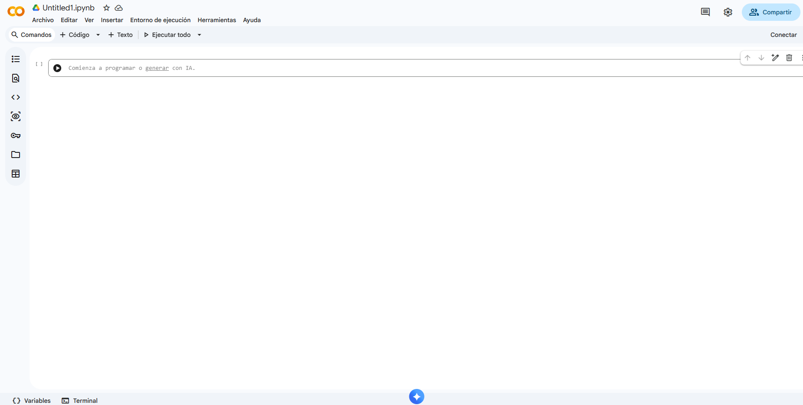
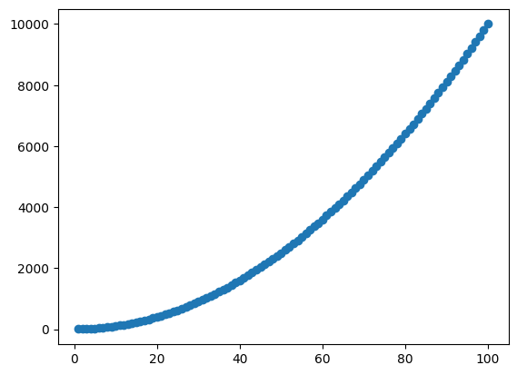

# **TP Python - Programando en biología**


### Software a usar
* Python (Google Colab)

### Recursos Online
* [Google Colab - Guía de inicio](https://colab.research.google.com/notebooks/intro.ipynb#scrollTo=GJBs_flRovLc)
* [Python Tutorial (Documentación oficial)](https://docs.python.org/3/tutorial/)
* [Pandas - User Guide](https://pandas.pydata.org/docs/user_guide/index.html)
* [Pandas Cheat Sheet](https://pandas.pydata.org/Pandas_Cheat_Sheet.pdf)
* [Curso Kaggle Learn - Python](https://www.kaggle.com/learn/python)
* [Curso Kaggle Learn - Pandas](https://www.kaggle.com/learn/pandas)


### Objetivos
* Familiarizarse con diferentes librerías del lenguaje de programación **Python**.
* Utilizar herramientas de programación para resolver problemas biológicos.

### Conocimientos previos de Python
Ya cuentan con conocimientos básicos de Python, por lo que en este trabajo práctico no se volverán a desarrollar los conceptos fundamentales del lenguaje. De todas formas, en el Anexo encontrarán una introducción breve y práctica a algunos de estos conceptos, acompañada de ejemplos y ejercicios sencillos, que pueden utilizar como material de consulta o repaso. Allí se incluyen temas como variables (números y cadenas de texto), listas, diccionarios, booleanos, estructuras condicionales (if) y ciclos (for y while).

## **Google Colab - Empezamos con el TP**

**Google Colab** es un entorno de desarrollo basado en la nube que permite escribir y ejecutar código en *Python* directamente desde el navegador, sin necesidad de instalar programas en la computadora. Al igual que otros **IDEs** (Integrated Development Environments), ofrece un espacio para escribir código, ejecutarlo, detectar errores (debuguear) y visualizar los resultados en un mismo lugar.

Una de las principales ventajas de **Google Colab** es que ya incluye instaladas muchas de las bibliotecas más utilizadas para el análisis de datos, como *NumPy, Pandas, Matplotlib y Seaborn*, además de permitir el uso gratuito de recursos de cómputo como GPU y TPU cuando es necesario. Asimismo, los cuadernos (notebooks) pueden compartirse fácilmente mediante un enlace, facilitando el trabajo colaborativo y la reproducción de análisis por parte de otros usuarios.

✏️**1)** Abran Google Colab desde el navegador ([Google Colab](https://colab.research.google.com/)) 

✏️**2)** Creen un nuevo *notebook* haciendo click en Nuevo notebook en la parte superior

Ahora sí, deberían ver lo siguiente:



✏️**3)** Verificar que estemos utilizando Python. Para ejecutar código, Google Colab debe estar conectado a un entorno de ejecución. Para comprobar el lenguaje seleccionado, vayan a **Entorno de ejecución** ⟶ **Cambiar tipo de entorno de ejecución**. En la ventana que se abre, en **Tipo de entorno de ejecución** debería aparecer Python 3. Google Colab también permite ejecutar código en otros lenguajes, como por ejemplo, R. Si el entorno aún no está iniciado, hagan clic en Conectar (esquina superior derecha) para iniciar la sesión.

✏️**4)** Durante este trabajo práctico les pedimos que desactiven temporalmente la asistencia de IA de Google Colab. El objetivo de este TP es aprender los fundamentos de **Python**, por lo que es importante que escriban el código y resuelvan los ejercicios por sus propios medios. Una vez adquiridas estas bases, la asistencia de IA puede convertirse en una herramienta muy útil para programar de manera más eficiente.
Para hacerlo vayan a:
**Herramientas** ⟶ **Configuración** ⟶ **Asistencia de IA** ⟶ **Destildar todas las casillas**

* **Elementos principales de Google Colab**

<p><strong>▶ Celdas de código (zona central del notebook)</strong></p>

Las celdas de código contienen instrucciones en Python. Para ejecutarlas pueden hacer clic en el botón ▶ ubicado a la izquierda de la celda o presionar <kbd>Shift</kbd> + <kbd>Enter</kbd>, lo que además ejecuta la celda y selecciona la siguiente.


<p><strong>▶ Celdas de texto (zona central del notebook)</strong></p>

Las celdas de texto permiten escribir explicaciones, títulos o consignas usando Markdown. En este trabajo práctico las utilizaremos para organizar el contenido y describir los ejercicios.


<p><strong>▶ Panel de variables (zona inferior del notebook)</strong></p>
En el panel Variables pueden ver las variables que fueron creadas durante la ejecución del notebook. Esto resulta útil para inspeccionar datos y comprobar que el código está funcionando como esperan. A veces, este panel puede no actualizarse correctamente o no mostrar todas las variables creadas. Si esto ocurre, prueben a actualizar la página (F5). Si no, pueden ejecutar el siguiente comando para listar todas las variables definidas en la sesión:

    %whos

<p><strong>▶ Archivos (barra lateral izquierda)</strong></p>

En la pestaña Archivos pueden explorar los archivos disponibles en la sesión de Colab y subir nuevos archivos desde su computadora. Más adelante utilizaremos esta pestaña para cargar los datos que analizaremos.

<p><strong>▶ Terminal (zona inferior del notebook)</strong></p>

Google Colab también dispone de una terminal (Bash), desde la cual es posible ejecutar comandos del sistema operativo, de forma similar a la terminal que utilizamos en los trabajos prácticos anteriores. En este trabajo práctico utilizaremos las celdas de código para ejecutar programas en Python.


* **Guardar el notebook**

Si modifican el notebook y desean conservar los cambios, pueden guardarlo en su cuenta de Google Drive usando **Archivo → Guardar** o **Archivo → Guardar una copia en Drive**. El mismo se va a guardar por defecto en la carpeta **Colab Notebooks**. Pueden acceder a través de **Archivo → Ubicar en Drive**.

* **Reiniciar el entorno**

Las variables creadas en una sesión permanecen en memoria hasta que el entorno se reinicia. Si obtienen resultados inesperados, una buena práctica es ejecutar **Entorno de ejecución → Reiniciar sesión** y volver a correr las celdas desde el comienzo.

* **Ayuda de las funciones**

En **Google Colab** pueden obtener información sobre una función simplemente dejando el cursor sobre su nombre. También pueden escribir el nombre de la función seguido de `?`, por ejemplo:

```python
print?
```

Esto mostrará una breve descripción de la función y los argumentos que acepta.

## **Librerías**

Hasta ahora trabajamos únicamente con funciones y estructuras que forman parte de **Python**. Sin embargo, una de las mayores fortalezas del lenguaje es la enorme cantidad de **librerías** desarrolladas por la comunidad.

Una **librería** es un conjunto de funciones y herramientas escritas por otras personas que podemos reutilizar en nuestros programas. En lugar de escribir todo desde cero, simplemente cargamos la librería y utilizamos sus funciones.

Por ejemplo:

* **pandas** permite trabajar con tablas de datos.
* **numpy** agrega herramientas para realizar cálculos numéricos de forma eficiente.
* **matplotlib** permite crear gráficos.
* **scikit-learn** proporciona algoritmos y herramientas para *Machine Learning*.
* **BioPython** incluye funciones específicas para bioinformática.

### Instalar librerías

Las librerías pueden instalarse utilizando el gestor de paquetes **pip**. Por ejemplo, para instalar **pandas** desde una terminal se utiliza:

```bash
pip install pandas
```

Esta instalación solo es necesaria una vez por computadora.

Google Colab ya incluye instaladas muchas de las librerías más utilizadas para ciencia de datos y bioinformática, entre ellas **pandas**, **numpy**, **matplotlib** y **scikit-learn**. Por lo tanto, en este curso normalmente no será necesario instalarlas.

### Importar librerías

Aunque una librería ya esté instalada, es necesario **importarla** en cada notebook donde vayamos a utilizarla.

La forma más común de hacerlo es mediante la instrucción `import`. Por ejemplo:

```python
import pandas
```

A partir de ese momento podremos utilizar todas las funciones y herramientas de esa librería escribiendo su nombre seguido de un punto (`.`). Por ejemplo:

```python
pandas.DataFrame(...)
```

Como escribir el nombre completo de la librería muchas veces puede resultar incómodo, **Python** permite asignarle un **alias**, es decir, un nombre más corto que utilizaremos durante el resto del programa.

Esto se hace con la palabra `as`:

```python
import pandas as pd
```

En este ejemplo, `pd` es simplemente un alias de `pandas`. Por lo tanto, las siguientes instrucciones son equivalentes:

```python
pandas.DataFrame(...)
```

```python
pd.DataFrame(...)
```

El uso de alias es muy común en **Python** y facilita la escritura del código. Algunas convenciones ampliamente utilizadas son:

```python
import pandas as pd
import numpy as np
import matplotlib.pyplot as plt
```

## **NumPy: Arrays**

Ya conocen las **listas**, que son una de las estructuras de datos más utilizadas en **Python**. Sin embargo, cuando queremos realizar cálculos numéricos sobre grandes cantidades de datos (como suele ocurrir en bioinformática), las listas no son la herramienta más eficiente.

Para este tipo de tareas existe la librería **NumPy**, que proporciona un tipo de dato llamado **array**. Un array es similar a una lista, pero está optimizado para almacenar grandes cantidades de datos del mismo tipo y realizar operaciones matemáticas de forma muy eficiente.

### Crear arrays

Los arrays pueden crearse de distintas maneras. Una de las más comunes es utilizando la función `array()`.

```python
import numpy as np

array = np.array([1, 2, 3, 4, 5])

print(array)
```

También podemos crear secuencias de números utilizando `arange()`:

```python
array = np.arange(1, 11)

print(array)
```

```text
[ 1  2  3  4  5  6  7  8  9 10]
```

Los arrays pueden contener distintos tipos de datos, incluyendo strings. Por ejemplo, podemos utilizarlos para almacenar secuencias de ADN.

```python
import numpy as np

secuencias = np.array(["ATGCGT", "GGCCTA", "TACGGA", "CCATGC"])

print(secuencias)
```
### Acceder a elementos de un array
Al igual que en las listas de Python, podemos acceder a los elementos de un array utilizando índices. Recordemos que el primer elemento ocupa la posición 0.

```python
concentraciones = np.array([10, 20, 30, 40, 50])

print(concentraciones[0])
print(concentraciones[2])
```

```text
10
30
```

### Operaciones matemáticas

Una de las principales ventajas de los arrays es que las operaciones matemáticas se realizan **elemento a elemento**.

```python
concentraciones = np.array([10, 20, 30, 40])

print(concentraciones + 2)

print(concentraciones * 3)

print(concentraciones ** 2)
```

```text
[12 22 32 42]
[ 30  60  90 120]
[ 100  400  900 1600]
```

#### ✏️ Ejercicio 1
Para observar la diferencia entre las operaciones realizadas sobre arrays de NumPy y sobre listas de Python, ejecuten el siguiente código:
```python
import numpy as np

concentraciones_array = np.array([10, 20, 30, 40])

print(concentraciones_array * 2)


concentraciones_lista = [10, 20, 30, 40]

print(concentraciones_lista * 2)
```
<strong>✏️ Pregunta:</strong><br>
**¿Cómo les dio cada resultado? ¿Qué diferencia observan entre las operaciones realizadas sobre el array y sobre la lista?**

### Funciones sobre arrays

NumPy también incluye muchas funciones matemáticas que trabajan directamente sobre arrays.

```python
print(np.mean(concentraciones))

print(np.max(concentraciones))

print(np.min(concentraciones))
```

```text
25.0
40
10
```

Muchas funciones de **NumPy** aceptan arrays como entrada y devuelven otro array como resultado, lo que permite escribir programas muy compactos y eficientes.

Las listas son estructuras generales de **Python** que pueden contener elementos de distintos tipos. Los arrays de **NumPy**, en cambio, están pensados para trabajar con datos numéricos y suelen ser mucho más rápidos al realizar cálculos matemáticos

## **Google Drive**

Si hasta ahora hubiéramos trabajado con archivos almacenados dentro de la sesión de Google Colab, es importante tener en cuenta que esa sesión es **temporal**: si la cerráramos o se reiniciara el entorno de ejecución, todos los archivos almacenados localmente se perderían.

Una forma de evitar esto es **montar Google Drive**, lo que permite acceder directamente a los archivos almacenados en nuestra cuenta de Google, de forma similar a si fueran una carpeta más de la computadora.

Entre otras cosas, esto nos permite:

* Mantener organizados los notebooks y los datos del trabajo práctico.
* Evitar subir los mismos archivos cada vez que abrimos Colab.
* Guardar automáticamente tablas, figuras y resultados para utilizarlos en el futuro.

### ✏️Ejercicio 2 - Montar Google Drive

Para conectar Google Drive con Colab ejecuten la siguiente celda:

```python
from google.colab import drive
drive.mount("/content/drive")
```

Al ejecutarla aparecerá un enlace para autorizar el acceso a su cuenta de Google.

1. Hagan clic sobre el enlace.
2. Inicien sesión (si fuera necesario).
3. Autoricen a Google Colab a acceder a su Drive.

Si todo salió correctamente verán un mensaje similar a:

```text
Mounted at /content/drive
```

### Acceder a los archivos

Una vez montado el Drive, todos sus archivos estarán disponibles dentro de la carpeta:

```text
/content/drive/MyDrive/
```

Por ejemplo, si tienen un archivo llamado **datos.tsv** dentro de la carpeta **Bioinformatica**, podrán leerlo usando:

```python
import pandas as pd

df = pd.read_csv("/content/drive/MyDrive/Bioinformatica/datos.tsv", sep="\t")
```

Del mismo modo, cualquier archivo que escriban dentro de esa carpeta quedará guardado permanentemente en su cuenta de Google Drive.

### Verificar que el Drive fue montado

Pueden comprobar que todo funciona ejecutando:

```python
import os

os.listdir("/content/drive/MyDrive")
```
Este comando mostrará el contenido de la carpeta principal de su Google Drive.

También lo podrían hacer desde la terminal de Bash en Google Colab con: 

```bash
ls /content/drive/MyDrive
```

El Drive debe montarse nuevamente cada vez que se inicia una nueva sesión de Google Colab. Sin embargo, **los archivos almacenados en Google Drive no se pierden**, por lo que no será necesario volver a subirlos.


**Organización**

Es recomendable crear una carpeta para la materia (por ejemplo, **Introducción_Bioinformática**) y guardar allí todos los notebooks, datos y resultados de los trabajos prácticos. Esto facilitará encontrar los archivos y reutilizarlos en futuras clases.


## **Python: Tablas**

Hasta ahora vimos variables simples (como números y *strings*) y listas. Sin embargo, en bioinformática es muy común trabajar con **tablas**.

En **Python**, la librería más utilizada para trabajar con tablas es **pandas**. Las tablas de pandas reciben el nombre de **DataFrames**.

### Crear un DataFrame

```python
import pandas as pd

genes = ["ERT2", "TTR4", "REC1"]
esencial = [False, False, True]
expresion = [100, 1000, 10000]

df = pd.DataFrame({
    "gen": genes,
    "esencial": esencial,
    "expresion": expresion
})
```

Aca estamos creando un DataFrame llamado df que contiene 3 columnas, **gen**, **esencial** y **expresion**, cada una conteniendo una lista de valores. Es importante notar que todas las listas deben tener la misma longitud, ya que el primer elemento de cada una corresponde a la primera fila de la tabla, el segundo elemento a la segunda fila y así sucesivamente.

Observen que el contenido del `DataFrame()` está distribuido en varias líneas. En Python esto es completamente válido siempre que el código permanezca dentro de los paréntesis. Es una práctica muy recomendable cuando una función tiene muchos argumentos, ya que facilita la lectura del código.

Podemos visualizar el contenido del DataFrame escribiendo simplemente:

```python
print(df)
```

```python
   gen esencial expresion
0 ERT2    False       100
1 TTR4    False      1000
2 REC1     True     10000
```

### Acceder a columnas

Podemos acceder a una columna indicando su nombre entre corchetes:

```python
print(df["gen"])
```

```text
0    ERT2
1    TTR4
2    REC1
Name: gen, dtype: object
```
df["gen"] ya no es un DataFrame sino una Serie (Series), que representa una única columna de la tabla.

### Acceder a filas

Para acceder a una fila utilizaremos `iloc` (*integer location*). `iloc` permite acceder a las filas y columnas utilizando su **posición numérica**.

```python
print(df.iloc[0])
```

```text
gen            ERT2
esencial      False
expresion      100
Name: 0, dtype: object
```

Por ejemplo, `df.iloc[0]` devuelve la primera fila. Y `df.iloc[2]` devuelve la tercera fila del DataFrame.

<p><strong>▶ info "iloc y loc"</strong></p>
En este TP utilizaremos `iloc`, que accede a las filas mediante su posición (0, 1, 2, ...).

También existe `loc`, que permite acceder a las filas utilizando sus etiquetas, índices o booleanos.

### Acceder a elemento o celda
También podemos acceder a un elemento específico de la tabla, es decir, a una celda, indicando tanto la fila como la columna.

Una forma de hacerlo es utilizando iloc. Cuando utilizamos iloc, primero indicamos la fila y luego la columna:

```python
print(df.iloc[0, 2])
```
```text
100
```
En este caso, 0 indica la primera fila y 2 la tercera columna.

También podemos indicar la fila mediante su posición y luego acceder a la columna utilizando su nombre:
```python
print(df.iloc[0]["expresion"])
```

<p><strong>▶ Con .loc</strong></p>

También podemos acceder a una celda utilizando el nombre de la columna:

```python
print(df.loc[0, "expresion"])
```
    
```text
    100
 ```
De esta manera, loc permite indicar la etiqueta de la fila y el nombre de la columna.


### Filtrar con booleanos

Una de las operaciones más importantes al trabajar con tablas es filtrar las filas que cumplen una determinada condición.

Por ejemplo, podemos seleccionar solamente los genes cuya expresión sea mayor a 500:

```python
print(df[df["expresion"] > 500])
```
```text
    gen  esencial  expresion
1  TTR4     False       1000
2  REC1      True      10000
```
También podemos combinar condiciones. Por ejemplo, para seleccionar genes cuya expresión sea mayor a 500 y que sean esenciales:
```python
print(df[(df["expresion"] > 500) & (df["esencial"] == True)])
```
```text
    gen  esencial  expresion
2  REC1      True      10000
```
En este caso, & representa AND: ambas condiciones deben cumplirse.

* **"Importante: combinar condiciones en pandas"**

Cuando filtramos un `DataFrame` utilizando condiciones sobre columnas,
no utilizamos `and` y `or`. En su lugar, utilizamos:

- `&` → **AND**
- `|` → **OR**
- `~` → **NOT**

Además, cada condición debe estar entre paréntesis.

Por ejemplo:

```python
df[(df["expresion"] > 500) & (df["esencial"] == True)]
```

Para un **OR**:

```python
df[(df["expresion"] > 500) | (df["esencial"] == True)]
```

### Resumen de la tabla

Otra función muy útil es `info()`, que devuelve información general sobre la tabla:

```python
df.info()
```

Entre otras cosas, muestra:

* La cantidad de filas y columnas.
* El nombre de cada columna.
* El tipo de dato de cada columna.

También podemos utilizar `describe()`, que calcula distintos estadísticos para las columnas numéricas:

```python
df.describe()
```

Esta función devuelve información como el mínimo, máximo, promedio, desvío estándar y distintos percentiles.

### Escribir tablas

Para guardar un DataFrame utilizaremos la función `to_csv()`. Por ejemplo:

```python
df.to_csv("genes.tsv", sep="\t", index=False)
```

Los parámetros utilizados son:

* `df` es el DataFrame que queremos guardar.
* `"genes.tsv"` es el nombre del archivo de salida. Generalmente tendrá extensión **.tsv** si las columnas están separadas por tabulaciones o **.csv** si están separadas por comas.
* `sep="\t"` indica que las columnas estarán separadas por tabulaciones.
* `index=False` evita guardar la numeración de las filas como una columna adicional.

**Directorio de trabajo**

Si estamos trabajando en Google Colab y tenemos Google Drive montado, podemos indicar la ruta completa para guardar el archivo directamente en una carpeta de nuestro Drive:

```python
df.to_csv("/content/drive/MyDrive/TPP_bioinfo/genes.tsv", sep="\t", index=False)
```

También podemos cambiar el directorio de trabajo a esa carpeta y luego utilizar solamente el nombre del archivo:

```python
import os

os.chdir("/content/drive/MyDrive/TPP_bioinfo")

df.to_csv("genes.tsv", sep="\t", index=False)
```

En Google Colab también podemos utilizar `%cd` para cambiar el directorio de trabajo:

```python
%cd /content/drive/MyDrive/TPP_bioinfo 
```

A partir de ese momento, podemos utilizar solamente el nombre del archivo: 

```python
df.to_csv("genes.tsv", sep="\t", index=False)
```

En ambos casos, `genes.tsv` se guardará en el directorio de trabajo actual.

#### ✏️ Ejercicio 3
Guarden el DataFrame creado anteriormente con el nombre **genes_expresion.tsv**. Confirmen que el archivo fue creado correctamente desde la pestaña **Archivos** de Google Colab.

### Leer tablas

Para leer una tabla utilizaremos la función `read_csv()`. Por ejemplo:

```python
nuevo_df = pd.read_csv("genes.tsv", sep="\t")
```

Los parámetros utilizados son:

* `"genes.tsv"` es el nombre del archivo a leer. Si se trata de un *path* absoluto se leerá desde esa ubicación; si es un *path* relativo, será relativo al directorio actual.
* `sep="\t"` indica cuál es el separador utilizado entre las columnas del archivo.

#### ✏️ Ejercicio 4
Creen una variable llamada **nuevo_df** y carguen la tabla creada en el punto anterior. Utilicen `print()` para confirmar que el archivo se leyó correctamente.

### Datos faltantes: `NA`

En datos biológicos es frecuente encontrar **datos faltantes**. Por ejemplo, puede ocurrir que para una determinada muestra no se haya podido medir la expresión de un gen.

En un `DataFrame` de `pandas`, los datos faltantes suelen representarse como `NaN` (*Not a Number*):

```python
import pandas as pd

df = pd.DataFrame({
    "gen": ["TP53", "BRCA1", "MYC", "EGFR"],
    "expresion": [100, 250, None, 500]
})

print(df)
```

```text
     gen  expresion
0   TP53      100.0
1  BRCA1      250.0
2    MYC        NaN
3   EGFR      500.0
```
En este caso, el valor de expresión de MYC es desconocido o está ausente.

Cuando leemos una tabla desde un archivo, pandas reconoce automáticamente algunos valores como datos faltantes, como NA, NaN o celdas vacías.

Sin embargo, en algunos archivos los datos faltantes pueden estar representados utilizando una cadena específica. Por ejemplo, supongamos que nuestro archivo contiene:

```text
gen expresion
TP53    100
BRCA1   250
MYC ND
EGFR    500
```
En este caso, ND (Not Determined) indica que el valor no fue determinado.

Podemos indicarle a pandas que interprete "ND" como un dato faltante utilizando el parámetro na_values:
```python
import pandas as pd

df = pd.read_csv("genes.tsv", sep="\t", na_values="ND")
```
De esta manera, pandas convertirá automáticamente los valores "ND" en NaN.

Por ejemplo:
```python
import pandas as pd
df = pd.DataFrame({
    "gen": ["TP53", "BRCA1", "MYC", "EGFR"],
    "expresion": [100, 250, "ND", 500]
})

print(df)

df.to_csv("genes_expresion_ND.tsv", sep="\t", index=False)

df = pd.read_csv("genes_expresion_ND.tsv", sep="\t", na_values="ND")

print(df)
```

## ✏️**Ejercicio 5 - Tablas**

1. Creen una lista con los nombres de 5 genes (por ejemplo: "TP53", "BRCA1", "ACTB", "GAPDH", "MYC") y otra lista con sus niveles de expresión (pueden ser números entre 1 y 100).
2. Utilicen esas listas para crear un DataFrame con dos columnas llamadas gen y expresion.
    1. La columna **gen** deberá contener los nombres de los genes (*strings*).
    2. La columna **expresion** deberá contener los niveles de expresión (*numeros*).
3. Impriman por pantalla todos los valores de la columna **gen**.
4. Impriman por pantalla la tercera fila de la tabla.
5. Impriman por pantalla el valor de expresion correspondiente a la cuarta fila.
6. Impriman por pantalla todas las filas donde **expresion** sea menor o igual a 30.

<!-- 
Resolucion

```python
import pandas as pd

# 1. Crear las listas
genes = ["TP53", "BRCA1", "ACTB", "GAPDH", "MYC"]
expresion = [25, 80, 15, 45, 70]

# 2. Crear el DataFrame
df = pd.DataFrame({
    "gen": genes,
    "expresion": expresion
})

print(df)

# 3. Imprimir todos los valores de la columna "gen"
print(df["gen"])

# 4. Imprimir la tercera fila
print(df.iloc[2])

# 5. Imprimir el valor de expresion correspondiente a la cuarta fila
print(df.iloc[3]["expresion"])

# 6. Imprimir las filas donde expresion sea menor o igual a 30
print(df[df["expresion"] <= 30])
```
-->


## **Visualización de datos con matplotlib**

Una de las librerías más utilizadas para crear gráficos o plots en **Python** es **matplotlib**. En particular, utilizaremos el módulo `pyplot`, que suele importarse con el alias `plt`:

```python
import matplotlib.pyplot as plt
```

### Scatter plot

#### ✏️ Ejercicio 6
Escriban y ejecuten el siguiente código:

```python
import numpy as np
import matplotlib.pyplot as plt

x = np.arange(1, 101)
y = x ** 2

plt.scatter(x, y)
plt.show()
```

Si todo funcionó correctamente debería aparecer un gráfico donde cada punto representa un par de valores `(x, y)`. Este tipo de gráfico se conoce como **scatter plot** o **gráfico de dispersión**.



En este ejemplo:

* `plt.scatter()` crea el gráfico.
* `x` contiene los valores del eje horizontal.
* `y` contiene los valores del eje vertical.
* `plt.show()` muestra el gráfico en pantalla.

### Personalizar un gráfico

Podemos modificar distintos aspectos del gráfico utilizando otras funciones de `matplotlib`.

Por ejemplo:

```python
plt.scatter(x, y)

plt.title("x²")
plt.xlabel("x")
plt.ylabel("y")

plt.show()
```

También podemos cambiar el color de los puntos:

```python
plt.scatter(x, y, color="red")

plt.show()
```

### Guardar un gráfico

Una vez creado el gráfico, podemos guardarlo directamente desde el código utilizando:

```python
plt.savefig("grafico.png")
```

También es posible cambiar el formato del archivo:

```python
plt.savefig("grafico.svg")

plt.savefig("grafico.pdf")
```

Es recomendable llamar a `plt.savefig()` **antes** de `plt.show()`, ya que algunas versiones de **matplotlib** limpian la figura luego de mostrarla.

### Graficar datos de una tabla

Muchas veces los datos que queremos visualizar se encuentran en un **DataFrame**.

Por ejemplo:

```python
import pandas as pd
import matplotlib.pyplot as plt

df = pd.read_csv(
    "https://raw.githubusercontent.com/mwaskom/seaborn-data/master/iris.csv"
)

print(df)

plt.scatter(
    df["sepal_length"],
    df["petal_length"]
)

plt.xlabel("Sepal Length")
plt.ylabel("Petal Length")
plt.title("Sepal vs Petal Length")

plt.show()
```

## ✏️**Ejercicio 7 - Integrador**

En esta actividad vamos a integrar estos conocimientos en un problema de análisis de datos biológicos.

Imaginemos que somos un grupo de bioinformáticos que trabaja para un hospital. El equipo médico nos proporciona un conjunto de datos obtenido a partir de muestras de pacientes con lesiones mamarias y nos solicita realizar un análisis exploratorio de los datos.

Nuestro objetivo será analizar las características de las muestras, identificar posibles diferencias entre muestras benignas y malignas, explorar relaciones entre diferentes variables y generar visualizaciones que permitan comunicar los resultados.

Finalmente, prepararemos un informe individual para cada muestra, que podrá ser utilizado por el equipo médico como resumen de los datos analizados.

Se trata de un conjunto de datos construido a partir de imágenes celulares digitalizadas. Para cada muestra se calcularon diferentes características relacionadas con la morfología de los núcleos celulares presentes en las imágenes. Entre ellas se encuentran el radio, textura, perímetro, área, suavidad, compactación, concavidad, puntos cóncavos, simetría y dimensión fractal. Para cada característica se dispone de tres tipos de mediciones: el valor medio (mean), el error estándar (SE) y el valor denominado worst, que resume los valores más altos observados. En total, el conjunto contiene 30 variables numéricas, además de un identificador y la variable diagnosis.

La variable diagnosis indica si la muestra fue clasificada como:

B: benigna
M: maligna

El conjunto contiene 569 muestras, de las cuales 357 corresponden a muestras benignas y 212 a muestras malignas.

Por ejemplo, algunas de las variables que encontraremos son:

| Variable | Descripción |
|---|---|
| `radius_mean` | Radio medio de los núcleos celulares |
| `texture_mean` | Textura media |
| `perimeter_mean` | Perímetro medio |
| `area_mean` | Área media |
| `smoothness_mean` | Suavidad media |
| `compactness_mean` | Compactación media |
| `concavity_mean` | Concavidad media |
| `symmetry_mean` | Simetría media |
| `diagnosis` | Diagnóstico: benigno (`B`) o maligno (`M`) |


### ✏️Cargar los datos

Descarguen el archivo proporcionado para esta actividad y cárguenlo utilizando pandas.

```python
import pandas as pd
import matplotlib.pyplot as plt
import kagglehub

path = kagglehub.dataset_download(
    "yasserh/breast-cancer-dataset"
)

print("Path to dataset files:", path)

df = pd.read_csv(
    path + "/breast-cancer.csv"
)

print(df)
```


#### ✏️**1)** Exploración inicial
Antes de realizar cualquier análisis, queremos conocer el conjunto de datos.

* ¿Cuántas filas y columnas tiene el DataFrame?
* ¿Qué columnas contiene?
* ¿Qué tipo de dato tiene cada columna?
* ¿Existen datos faltantes?
* ¿Cuántas muestras corresponden a cada diagnóstico?
Para responder la última pregunta, pueden utilizar un filtro booleano

<p><strong>▶ Pista</strong></p>
`df.info()` puede ayudar a responder varias de las primeras preguntas.

Para contar las muestras de cada diagnóstico, pueden comenzar creando dos subconjuntos:
```python
df_benignas = df[df["diagnosis"] == "B"]

df_malignas = @@EDITAR@@
```
Luego pueden utilizar `len()` para conocer la cantidad de filas de cada subconjunto.


#### ✏️**2)** Comparación entre muestras benignas y malignas
Una de las preguntas que nos plantea el equipo médico es si existen diferencias en las características morfológicas de las células entre las muestras benignas y malignas.
¿Las muestras malignas presentan, en promedio, un mayor radius_mean que las muestras benignas?

Para responderla:

* Calculen el promedio de radius_mean para las muestras benignas.

* Calculen el promedio de radius_mean para las muestras malignas.

* Comparen ambos valores.

* Indiquen qué grupo presenta el mayor valor promedio.

Recuerden que primero pueden crear dos subconjuntos utilizando filtros booleanos.

* Pregunta de interpretación:¿La diferencia observada parece pequeña o grande en relación con los valores de la variable?

<p><strong>▶ Pista</strong></p>
Pueden separar primero las muestras benignas y malignas:

```python
df_benignas = df[df["diagnosis"] == "B"]

df_malignas = @@EDITAR@@
```

Para calcular el promedio de `radius_mean`:

```python
df_benignas["radius_mean"].mean()

df_malignas[@@EDITAR@@]@@EDITAR@@.
```
 

#### ✏️**3)** Distribución de una variable
Ahora queremos conocer cómo se distribuyen los valores de una variable.

Realicen un histograma de radius_mean utilizando matplotlib.

El gráfico debe incluir: título; nombre del eje X; nombre del eje Y.

* ¿Cómo se distribuyen los valores de radius_mean?
* ¿La distribución parece aproximadamente simétrica?
* ¿Observan valores particularmente altos o bajos?

<p><strong>▶ Pista</strong></p>

La función `plt.hist()` permite construir un histograma.

```python
plt.hist( ... )

plt.xlabel( ... )
plt.ylabel( ... )
plt.title( ... )

plt.show()
```

#### ✏️**4)** Comparar distribuciones 
Ahora queremos saber si la distribución de radius_mean es diferente entre las muestras benignas y malignas.

Realicen un gráfico que permita comparar ambas distribuciones.

Pueden utilizar dos histogramas superpuestos.

* ¿Qué diferencias observan entre ambos grupos?
* ¿Los valores de las muestras malignas tienden a concentrarse en un rango diferente?
* ¿Existe superposición entre ambos grupos?

<p><strong>▶ Pista</strong></p>

Ya crearon `df_benignas` y `df_malignas`.

Pueden utilizar dos llamadas a `plt.hist()`, una para cada subconjunto.

El parámetro `alpha` permite hacer transparentes los histogramas para visualizar mejor la superposición.


#### ✏️**5)** Relación entre dos variables
Ahora queremos investigar si existe una relación entre el tamaño de los núcleos celulares y su perímetro.

Realicen un gráfico de dispersión de:
radius_mean en el eje X.
perimeter_mean en el eje Y.

Diferencien las muestras según el diagnóstico. Agreguen una leyenda que permita identificar qué puntos corresponden a muestras benignas y cuáles a muestras malignas.

* ¿Existe una relación entre radius_mean y perimeter_mean?
* ¿La relación parece aproximadamente lineal?
* ¿Las muestras benignas y malignas ocupan regiones diferentes del gráfico?
* ¿Hay muestras que se encuentren dentro de la región predominante del otro grupo?

#### ✏️**6)** Identificación de muestras
Supongamos ahora que el equipo médico quiere identificar muestras con valores particularmente altos de algunas características.

Seleccionen todas las muestras que cumplan simultáneamente:

* radius_mean > 20
* area_mean > 1000

* ¿Cuántas muestras cumplen ambas condiciones?

* ¿Qué diagnóstico presentan esas muestras?

#### ✏️**7)** Informe individual de cada muestra
Finalmente, el hospital nos solicita generar un informe individual para cada muestra.

El informe estará destinado al equipo médico, por lo que debe presentar los resultados de manera clara y resumida. No se trata de un informe dirigido al paciente. 
El informe debe describir los datos y los resultados del análisis. No debe presentar una conclusión clínica ni afirmar que una muestra es cancerosa o no cancerosa a partir de los análisis realizados en este ejercicio.

Trabajaremos solamente con las primeras 50 muestras del conjunto de datos. El mismo procedimiento podría aplicarse posteriormente a las 569 muestras. 

Para cada muestra deberán generar un archivo de texto en una carpeta llamada Informes que contenga, como mínimo:

* ID de la muestra.
* Diagnóstico registrado en el dataset.
* radius_mean
* texture_mean
* perimeter_mean
* area_mean
* smoothness_mean
* compactness_mean
* concavity_mean
* symmetry_mean

Calculen, para cada muestra:

* diferencia respecto al promedio de las muestras benignas;
* diferencia respecto al promedio de las muestras malignas.

Para comenzar, trabajen con una sola muestra. Una vez que logren generar correctamente un informe, podrán automatizar el proceso para las demás muestras.

<p><strong>▶ Pista</strong></p>

**1. Seleccionar una muestra**

Pueden seleccionar, por ejemplo, la primera muestra:

```python
muestra = df.iloc[0]
```

Ahora pueden acceder a cada uno de sus valores utilizando el nombre de la columna:

```python
muestra[@@EDITAR@@]
muestra[@@EDITAR@@]

```

**2. Calcular las diferencias respecto a los grupos**

Primero calculen los valores promedio de `radius_mean` para las muestras benignas y malignas:

```python
promedio_benignas = @@EDITAR@@
promedio_malignas = @@EDITAR@@
```

Luego pueden calcular cuánto se diferencia la muestra seleccionada de cada promedio:

```python
diferencia_benigna = @@EDITAR@@
diferencia_maligna = @@EDITAR@@
```

**3. Crear el texto del informe**
Pueden construir el contenido del informe utilizando una `string`. Para incorporar
valores numéricos o valores almacenados en variables, pueden utilizar `str()`.
Se puede utilizar \n para indicar un salto de línea.

Por ejemplo:

```python
informe = f"""
INFORME DE ANÁLISIS DE MUESTRA

ID: {muestra["id"]}
Diagnóstico: {muestra["diagnosis"]}

Características:

Radius mean: {muestra["radius_mean"]}
Texture mean: {muestra["texture_mean"]}
Perimeter mean: {muestra["perimeter_mean"]}
Area mean: {muestra["area_mean"]}

Diferencia respecto al promedio de muestras benignas:
{diferencia_benigna}

Diferencia respecto al promedio de muestras malignas:
{diferencia_maligna}
"""
```

Pueden comprobar que el informe se construyó correctamente utilizando:

```python
print(informe)
```

**4. Guardar el informe**

Para guardar el contenido en un archivo de texto pueden utilizar `open()`.

Primero creen una carpeta llamada `Informes`:

```python
import os

os.makedirs("Informes", exist_ok=True)
```

Luego pueden guardar el informe dentro de esa carpeta:

```python
with open("Informes/informe.txt", "w") as archivo:
archivo.write(informe)
```

Comprueben que el archivo fue creado correctamente desde la pestaña
**Archivos** de Google Colab.

El archivo debería encontrarse dentro de:

```text
Informes/
└── informe.txt
```

**5. Ver el informe**

Una vez creado el archivo, pueden comprobar su contenido directamente desde 
Google Colab utilizando:

```python
with open("Informes/informe.txt", "r") as archivo:
print(archivo.read())
``` 

<!-- Resolución Ej 7
import os

# Crear los subconjuntos de muestras benignas y malignas
df_benignas = df[df["diagnosis"] == "B"]
df_malignas = df[df["diagnosis"] == "M"]

# Seleccionar una muestra
muestra = df.iloc[0]

# Calcular los promedios de radius_mean
promedio_benignas = df_benignas["radius_mean"].mean()
promedio_malignas = df_malignas["radius_mean"].mean()

# Calcular las diferencias respecto a los promedios
diferencia_benigna = muestra["radius_mean"] - promedio_benignas
diferencia_maligna = muestra["radius_mean"] - promedio_malignas

# Crear el texto del informe
informe = (
    "INFORME DE ANÁLISIS DE MUESTRA\n\n"
    + "ID: " + str(muestra["id"]) + "\n"
    + "Diagnóstico: " + str(muestra["diagnosis"]) + "\n\n"
    + "Características:\n\n"
    + "Radius mean: " + str(muestra["radius_mean"]) + "\n"
    + "Texture mean: " + str(muestra["texture_mean"]) + "\n"
    + "Perimeter mean: " + str(muestra["perimeter_mean"]) + "\n"
    + "Area mean: " + str(muestra["area_mean"]) + "\n"
    + "Smoothness mean: " + str(muestra["smoothness_mean"]) + "\n"
    + "Compactness mean: " + str(muestra["compactness_mean"]) + "\n"
    + "Concavity mean: " + str(muestra["concavity_mean"]) + "\n"
    + "Symmetry mean: " + str(muestra["symmetry_mean"]) + "\n\n"
    + "Diferencia respecto al promedio de muestras benignas: "
    + str(diferencia_benigna) + "\n"
    + "Diferencia respecto al promedio de muestras malignas: "
    + str(diferencia_maligna)
)

# Crear la carpeta Informes
os.makedirs("Informes", exist_ok=True)

# Guardar el informe
with open("Informes/informe.txt", "w") as archivo:
    archivo.write(informe)

print("Informe generado correctamente.")
-->

#### ✏️**8)** Automatizar la generación de informes
La generación manual de 50 informes sería una tarea muy poco eficiente.

Utilicen un ciclo para recorrer las primeras 50 muestras y generar automáticamente un txt para cada una.

El objetivo es que el programa:

Seleccione una muestra.
Extraiga sus datos.
Genere las visualizaciones correspondientes.
Cree el informe.
Guarde el txt con un nombre que permita identificar la muestra.
Pase automáticamente a la siguiente muestra.

Por ejemplo:

```text
reportes/
├── muestra_842302.pdf
├── muestra_842517.pdf
├── muestra_843009.pdf
├── ...
└── muestra_...
```

El código debería poder modificarse fácilmente para generar posteriormente los informes de todas las muestras del conjunto de datos, simplemente cambiando el número de muestras a procesar.

<p><strong>▶ Pista</strong></p>

En el ejercicio anterior generaron el informe para una única muestra.
Ahora queremos repetir automáticamente ese procedimiento para las primeras
50 muestras.

**1. Recorrer las muestras**

Pueden utilizar un ciclo `for` junto con `range()` para recorrer las primeras
50 filas del `DataFrame`:

```python
for i in range(@@EDITAR@@):

muestra = df.iloc[i]

...
```

Dentro del ciclo deberán colocar las instrucciones necesarias para generar
el informe correspondiente a cada muestra.

**2. Repetir el procedimiento del ejercicio anterior**

Para cada muestra deberán:

- acceder a sus datos;
- calcular la diferencia de `radius_mean` respecto a los promedios;
- construir el texto del informe;
- guardar el informe en un archivo.

  Es decir, pueden reutilizar gran parte del código que desarrollaron en el
  ejercicio anterior.

  **3. Darle un nombre diferente a cada archivo**

  No pueden utilizar siempre:

  ```python
  "Informes/informe.txt"
  ```

  porque cada nuevo informe reemplazaría al anterior.

  Pueden construir el nombre del archivo utilizando el identificador de la
  muestra:

  ```python
  nombre_archivo = "Informes/muestra_" + str(muestra["id"]) + ".txt"
  ```

  Luego pueden utilizar `nombre_archivo` para guardar el informe:

  ```python
  with open(nombre_archivo, "w") as archivo:
  archivo.write(informe)
  ```

  Al finalizar el ciclo deberían obtener una carpeta similar a:

  ```text
  Informes/
  ├── muestra_842302.txt
  ├── muestra_842517.txt
  ├── muestra_843009.txt
  ├── ...
  └── muestra_...
  ```

  **4. ¿Qué debe estar dentro y fuera del ciclo?**

  Piensen qué instrucciones dependen de la muestra que estamos analizando y
    cuáles no.

  Por ejemplo, los promedios de `radius_mean` de las muestras benignas y
  malignas son los mismos para todas las muestras. Por lo tanto, no es
  necesario calcularlos nuevamente en cada vuelta del ciclo.

  El `for` debería encargarse principalmente de tomar una muestra, analizarla
  y guardar su informe antes de pasar a la siguiente.


<!-- Resolución Ej 8
    import os

# Crear los subconjuntos de muestras benignas y malignas
df_benignas = df[df["diagnosis"] == "B"]
df_malignas = df[df["diagnosis"] == "M"]

# Calcular los promedios una sola vez
promedio_benignas = df_benignas["radius_mean"].mean()
promedio_malignas = df_malignas["radius_mean"].mean()

# Crear la carpeta donde se guardarán los informes
os.makedirs("Informes", exist_ok=True)

# Recorrer las primeras 50 muestras
for i in range(50):

    # Seleccionar la muestra
    muestra = df.iloc[i]

    # Calcular las diferencias respecto a los promedios
    diferencia_benigna = muestra["radius_mean"] - promedio_benignas
    diferencia_maligna = muestra["radius_mean"] - promedio_malignas

    # Crear el texto del informe
    informe = (
        "INFORME DE ANÁLISIS DE MUESTRA\n\n"
        + "ID: " + str(muestra["id"]) + "\n"
        + "Diagnóstico: " + str(muestra["diagnosis"]) + "\n\n"
        + "Características:\n\n"
        + "Radius mean: " + str(muestra["radius_mean"]) + "\n"
        + "Texture mean: " + str(muestra["texture_mean"]) + "\n"
        + "Perimeter mean: " + str(muestra["perimeter_mean"]) + "\n"
        + "Area mean: " + str(muestra["area_mean"]) + "\n"
        + "Smoothness mean: " + str(muestra["smoothness_mean"]) + "\n"
        + "Compactness mean: " + str(muestra["compactness_mean"]) + "\n"
        + "Concavity mean: " + str(muestra["concavity_mean"]) + "\n"
        + "Symmetry mean: " + str(muestra["symmetry_mean"]) + "\n\n"
        + "Diferencia respecto al promedio de muestras benignas: "
        + str(diferencia_benigna) + "\n"
        + "Diferencia respecto al promedio de muestras malignas: "
        + str(diferencia_maligna)
    )

    # Crear un nombre diferente para cada informe
    nombre_archivo = (
        "Informes/muestra_"
        + str(muestra["id"])
        + ".txt"
    )

    # Guardar el informe
    with open(nombre_archivo, "w") as archivo:
        archivo.write(informe)

print("Informes generados correctamente.")
-->

## Cierre del Tutorial

Completa la siguiente tabla para resumir lo visto:

| Tema | Herramienta(s) utilizada(s) | Tipo de datos | Análisis del resultado |
| :--- | :--- | :--- | :--- |
| Arrays | (completar) | (completar) | (completar) |
| Tablas | (completar) | (completar) | (completar) |
| Plots o gráficos | (completar) | (completar) | (completar) |

**Objetivos**
- Familiarizarse con diferentes librerías del lenguaje de programación **Python**. (Sí / No)
- Utilizar herramientas de programación para resolver problemas biológicos. (Sí / No)
